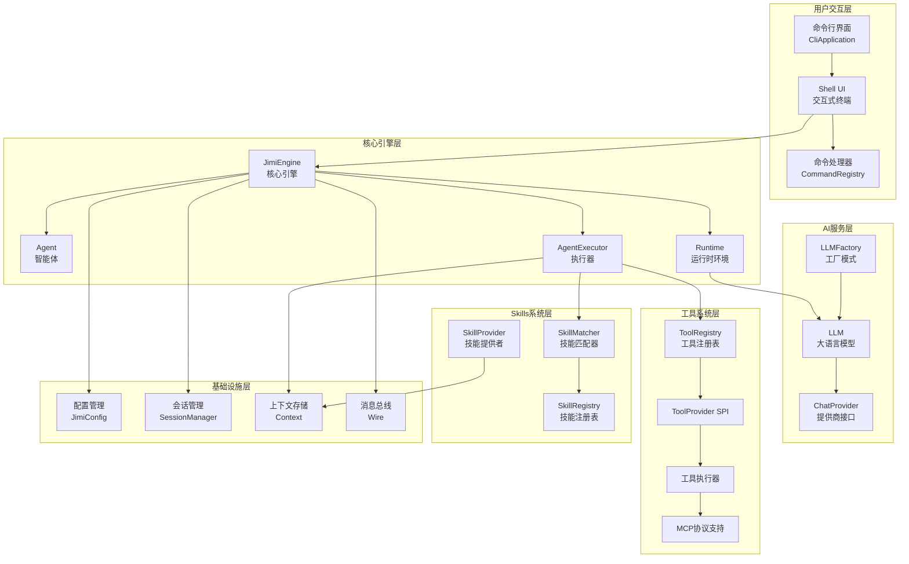
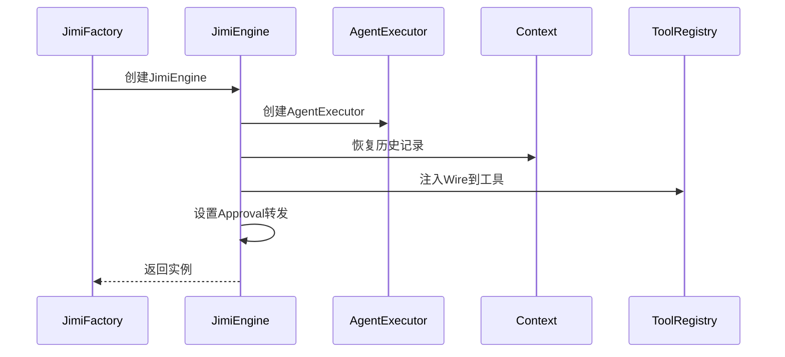
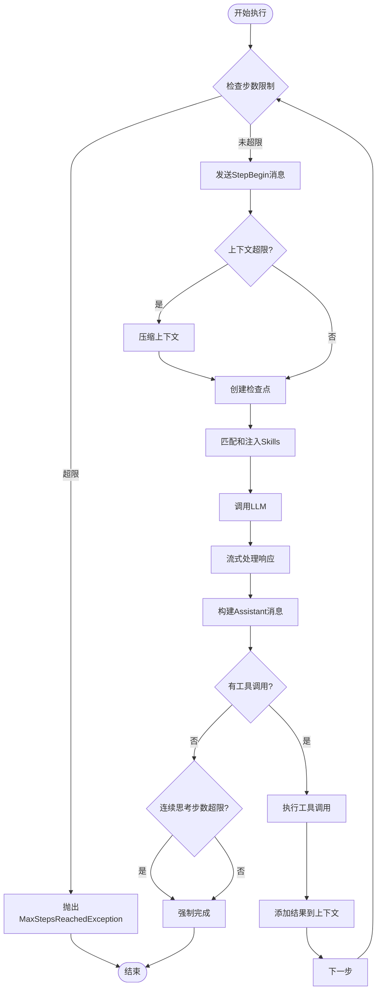
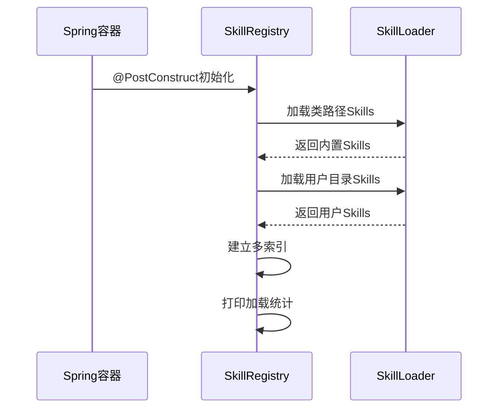
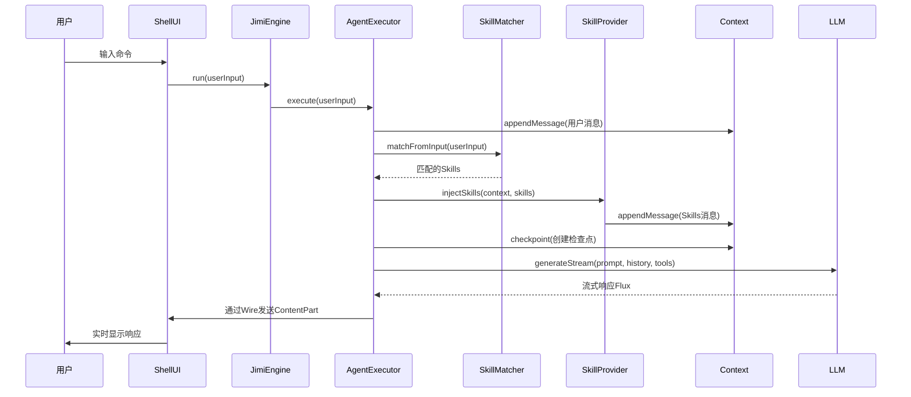
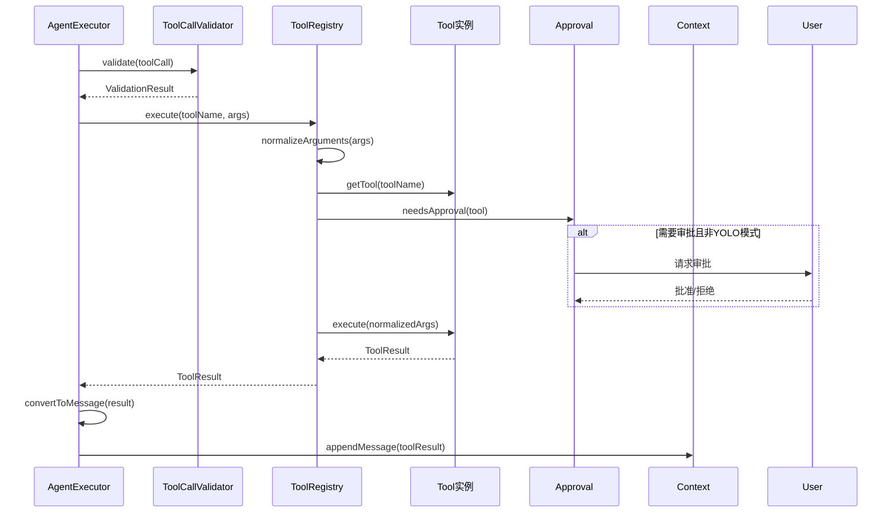
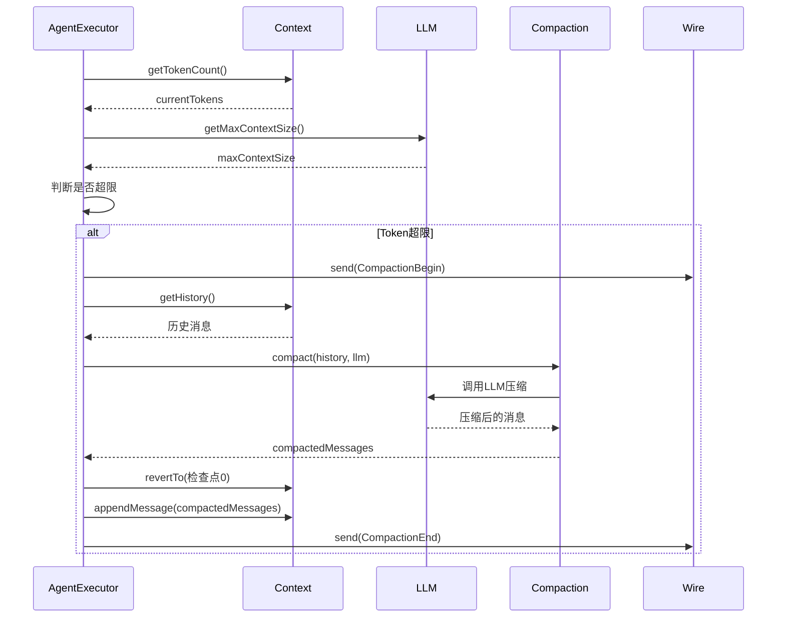
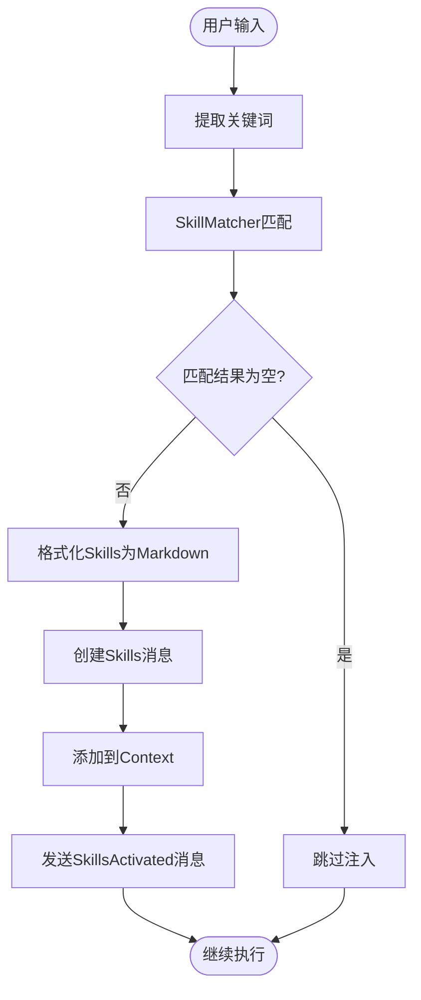

# Jimi 技术架构设计文档

## 文档概述

**文档版本**: v1.0  
**创建日期**: 2025-11-12  

本文档详细阐述Jimi项目的技术架构设计，包括系统模块划分、核心组件功能、关键接口设计、数据
流转逻辑以及技术实现细节，旨在为开发者提供全面的技术参考。

---

## 目录

- [1. 系统概述](#1-系统概述)
- [2. 技术架构](#2-技术架构)
- [3. 模块划分与职责](#3-模块划分与职责)
- [4. 核心组件设计](#4-核心组件设计)
- [5. 关键接口规范](#5-关键接口规范)
- [6. 数据流转逻辑](#6-数据流转逻辑)
- [7. 技术选型与实现](#7-技术选型与实现)
- [8. 性能优化策略](#8-性能优化策略)
- [9. 安全性设计](#9-安全性设计)
- [10. 扩展性机制](#10-扩展性机制)
- [11. 部署与运维](#11-部署与运维)

---

## 1. 系统概述

### 1.1 项目定位

Jimi是一个基于人工智能的命令行智能代理系统，专为软件开发场景设计。它将先进的大语言模型（LLM）能力与丰富的工具生态系统相结合，为开发者提供AI驱动的开发助手。

### 1.2 核心能力

- **自然语言交互**: 通过命令行进行自然语言对话
- **智能工具调用**: 自动选择并执行合适的工具完成任务
- **多LLM支持**: 兼容多种大语言模型提供商
- **Agent专业化**: 支持不同领域的专业化智能体
- **Skills技能包**: 动态注入领域知识和最佳实践
- **MCP协议集成**: 支持Model Context Protocol标准扩展

### 1.3 应用场景

- 代码生成与重构
- 架构设计与技术选型
- 代码审查与质量分析
- 单元测试编写
- 文档生成与维护
- 问题排查与调试

---

## 2. 技术架构

### 2.1 整体架构图



### 2.2 架构特点

#### 分层架构设计

采用清晰的分层架构，各层职责明确：

- **用户交互层**: 负责命令行交互和用户体验
- **核心引擎层**: 协调各组件，驱动AI推理和任务执行
- **AI服务层**: 封装LLM调用，支持多提供商
- **工具系统层**: 提供工具注册、执行和扩展能力
- **Skills系统层**: 动态注入领域知识
- **基础设施层**: 提供配置、会话、上下文等基础服务

#### 响应式架构

基于Spring WebFlux和Reactor框架，采用响应式编程模型：

- 非阻塞I/O操作
- 流式处理LLM响应
- 背压机制保护系统
- 高并发处理能力

#### 模块化与可扩展

- **插件化工具系统**: 通过ToolProvider SPI机制扩展
- **可配置Agent**: YAML配置文件定义Agent行为
- **多LLM支持**: 统一接口兼容多种模型
- **MCP协议**: 标准化外部服务集成

---

## 3. 模块划分与职责

### 3.1 模块结构

```
io.leavesfly.jimi
├── agent/              # Agent系统
│   ├── Agent.java               # Agent实体
│   ├── AgentSpec.java           # Agent规范
│   ├── AgentRegistry.java       # Agent注册表
│   └── AgentSpecLoader.java     # 规范加载器
├── cli/                # 命令行入口
│   └── CliApplication.java      # 应用入口
├── command/            # 命令处理
│   ├── CommandHandler.java      # 命令处理接口
│   ├── CommandRegistry.java     # 命令注册表
│   └── handlers/                # 内置命令处理器
├── config/             # 配置管理
│   ├── JimiConfig.java          # 核心配置
│   ├── ConfigLoader.java        # 配置加载器
│   └── LLMProviderConfig.java   # LLM配置
├── engine/             # 核心引擎
│   ├── Engine.java              # 引擎接口
│   ├── JimiEngine.java          # 引擎实现
│   ├── AgentExecutor.java       # 执行器
│   ├── approval/                # 审批机制
│   ├── compaction/              # 上下文压缩
│   ├── context/                 # 上下文管理
│   ├── runtime/                 # 运行时环境
│   └── toolcall/                # 工具调用处理
├── llm/                # LLM集成
│   ├── LLM.java                 # LLM包装类
│   ├── LLMFactory.java          # LLM工厂
│   ├── ChatProvider.java        # 提供商接口
│   ├── message/                 # 消息模型
│   └── provider/                # 提供商实现
├── mcp/                # MCP协议
│   ├── JsonRpcClient.java       # JSON-RPC客户端
│   ├── MCPConfig.java           # MCP配置
│   └── MCPToolProvider.java     # MCP工具提供者
├── session/            # 会话管理
│   ├── Session.java             # 会话实体
│   └── SessionManager.java      # 会话管理器
├── skill/              # Skills系统
│   ├── SkillSpec.java           # Skill规范
│   ├── SkillRegistry.java       # Skill注册表
│   ├── SkillMatcher.java        # Skill匹配器
│   └── SkillProvider.java       # Skill提供者
├── tool/               # 工具系统
│   ├── Tool.java                # 工具接口
│   ├── ToolRegistry.java        # 工具注册表
│   ├── ToolProvider.java        # 工具提供者SPI
│   ├── ToolRegistryFactory.java # 工具工厂
│   └── [各类工具实现]
├── ui/                 # 用户界面
│   └── shell/                   # Shell界面
├── wire/               # 消息总线
│   ├── Wire.java                # 消息总线接口
│   └── message/                 # 消息类型
└── JimiFactory.java    # 核心工厂
```

### 3.2 核心模块职责

#### Agent模块

**职责**: 管理智能体的定义、加载和注册

- `Agent`: 智能体实体，包含名称、系统提示词、工具列表
- `AgentSpec`: 智能体规范，定义配置结构
- `AgentRegistry`: 集中管理所有可用的Agent
- `AgentSpecLoader`: 从YAML文件加载Agent配置

**设计亮点**:
- 支持系统提示词模板变量替换
- 支持子Agent机制（Subagent）
- 支持工具包含/排除配置
- 缓存已加载的Agent规范

#### Engine模块

**职责**: 核心执行引擎，协调各组件工作

- `Engine`: 引擎接口定义
- `JimiEngine`: 引擎实现，组件装配和协调
- `AgentExecutor`: 执行器，负责主循环和工具调用
- `Context`: 上下文管理，历史记录和Token计数
- `Runtime`: 运行时环境，提供LLM、审批等服务
- `Compaction`: 上下文压缩策略

**设计亮点**:
- 委托执行模式：JimiEngine专注协调，AgentExecutor负责执行
- 响应式编程：基于Reactor的异步流处理
- 上下文检查点机制：支持回退和恢复
- 智能上下文压缩：防止超出模型限制

#### LLM模块

**职责**: 大语言模型集成和管理

- `LLM`: LLM包装类，提供统一接口
- `LLMFactory`: 工厂模式，创建和缓存LLM实例
- `ChatProvider`: 提供商接口，统一不同LLM的调用方式
- `Message`: 消息模型，支持多种内容类型
- 提供商实现：支持Kimi、OpenAI、DeepSeek、Qwen、Ollama等

**设计亮点**:
- Caffeine缓存：高性能LLM实例缓存
- 环境变量覆盖：API Key优先从环境变量读取
- 流式响应处理：支持SSE流式输出
- 统一接口：屏蔽不同提供商的差异

#### Tool模块

**职责**: 工具系统，提供可执行的操作能力

- `Tool`: 工具接口，定义工具行为
- `ToolRegistry`: 工具注册表，管理所有工具
- `ToolProvider`: SPI接口，支持插件化扩展
- `ToolRegistryFactory`: 工具注册表工厂
- 内置工具：文件操作、Shell执行、网络请求等

**设计亮点**:
- SPI扩展机制：通过ToolProvider接口扩展工具
- 工具Schema：自动生成工具描述供LLM使用
- 审批机制：危险操作需要用户确认
- 响应式执行：工具调用返回Mono<ToolResult>

#### Skills模块

**职责**: 动态注入领域知识和最佳实践

- `SkillSpec`: Skill规范，定义技能内容
- `SkillRegistry`: Skill注册表，管理所有技能
- `SkillMatcher`: 智能匹配器，根据输入匹配相关Skill
- `SkillProvider`: 技能提供者，负责注入到上下文

**设计亮点**:
- 多策略匹配：关键词、分类、语义匹配
- Caffeine缓存：匹配结果缓存优化性能
- 作用域管理：全局Skill和项目Skill
- Markdown格式：清晰的Skill内容展示

---

## 4. 核心组件设计

### 4.1 JimiEngine - 核心引擎

#### 设计理念

JimiEngine是整个系统的核心组件，采用**委托执行模式**，专注于组件装配和协调，将实际的执
行逻辑委托给AgentExecutor。

#### 类设计

```java
@Slf4j
public class JimiEngine implements Engine {
    // 核心依赖
    private final Agent agent;                    // 智能体
    private final Runtime runtime;                // 运行时环境
    private final Context context;                // 上下文存储
    private final Wire wire;                      // 消息总线
    private final ToolRegistry toolRegistry;      // 工具注册表
    private final Compaction compaction;          // 压缩策略
    private final AgentExecutor executor;         // 执行器
    
    // Skills支持（可选）
    private final SkillMatcher skillMatcher;
    private final SkillProvider skillProvider;
    
    // 主要方法
    public Mono<Void> run(String userInput);
    public Map<String, Object> getStatus();
}
```

#### 职责边界

**负责**:
- 组件装配和依赖注入
- 对外API提供（实现Engine接口）
- Wire事件转发
- 状态查询

**不负责**:
- 主循环控制（委托给AgentExecutor）
- 工具调用编排（委托给AgentExecutor）
- LLM交互处理（委托给AgentExecutor）

#### 初始化流程



### 4.2 AgentExecutor - 执行器

#### 设计理念

AgentExecutor负责Agent的主循环执行，处理LLM交互、工具调用和Skills注入，采用**单一职责**
原则，专注于执行流程。

#### 核心流程



#### 关键机制

**1. 流式响应处理**

使用StreamAccumulator累积流式数据：

```java
private static class StreamAccumulator {
    StringBuilder contentBuilder = new StringBuilder();
    List<ToolCall> toolCalls = new ArrayList<>();
    ChatCompletionResult.Usage usage;
    
    // 临时存储正在构建的工具调用
    String currentToolCallId;
    String currentFunctionName;
    StringBuilder currentArguments = new StringBuilder();
}
```

**2. 工具调用容错**

处理不同LLM的流式API差异：
- 支持延迟ID分配（先收到arguments，后收到ID）
- 临时ID机制确保数据不丢失
- 函数名延迟更新支持

**3. 连续思考控制**

防止Agent无限思考而不采取行动：
- 跟踪连续无工具调用步数
- 超过MAX_THINKING_STEPS（5步）强制终止

**4. Skills智能注入**

在第一步基于用户输入匹配Skills：
```java
private Mono<Void> matchSkillsFromUserInput() {
    // 提取用户消息
    // 调用SkillMatcher匹配
    // 通过SkillProvider注入
    // 发送SkillsActivated消息
}
```

### 4.3 LLMFactory - LLM工厂

#### 设计模式

采用**工厂模式**和**缓存模式**，统一管理LLM实例的创建和复用。

#### Caffeine缓存

```java
private final Cache<String, LLM> llmCache = Caffeine.newBuilder()
    .maximumSize(10)                          // 最多缓存10个模型
    .expireAfterAccess(30, TimeUnit.MINUTES)  // 30分钟未使用过期
    .recordStats()                            // 记录统计信息
    .build();
```

#### API Key解析优先级

```
1. 环境变量（{PROVIDER}_API_KEY）
   ↓
2. 配置文件中的API Key
   ↓
3. 返回null（触发错误）
```

#### 支持的提供商

| 提供商 | 类型 | 实现类 |
|--------|------|--------|
| Kimi/Moonshot | 专用 | KimiChatProvider |
| OpenAI | 通用 | OpenAICompatibleChatProvider |
| DeepSeek | 兼容OpenAI | OpenAICompatibleChatProvider |
| Qwen | 兼容OpenAI | OpenAICompatibleChatProvider |
| Ollama | 本地模型 | OpenAICompatibleChatProvider |
| Claude | 兼容OpenAI | OpenAICompatibleChatProvider |

### 4.4 ToolRegistry - 工具注册表

#### 设计理念

ToolRegistry是工具系统的中央管理器，负责工具的注册、查询、Schema生成和执行调度。

#### 核心方法

```java
public class ToolRegistry {
    // 工具存储
    private final Map<String, Tool<?>> tools = new ConcurrentHashMap<>();
    
    // 注册工具
    public void register(Tool<?> tool);
    
    // 获取工具
    public Optional<Tool<?>> getTool(String name);
    
    // 获取工具Schema（供LLM使用）
    public List<Object> getToolSchemas(List<String> toolNames);
    
    // 执行工具
    public Mono<ToolResult> execute(String toolName, String arguments);
}
```

#### 工具Schema生成

自动将Tool的Java Schema转换为LLM可理解的JSON Schema：

```java
public List<Object> getToolSchemas(List<String> toolNames) {
    return toolNames.stream()
        .map(this::getTool)
        .filter(Optional::isPresent)
        .map(Optional::get)
        .map(Tool::getSchema)
        .collect(Collectors.toList());
}
```

#### 参数标准化

处理不同LLM返回的参数格式差异：

```java
private Map<String, Object> normalizeArguments(Object rawArgs) {
    if (rawArgs == null) {
        return Collections.emptyMap();
    }
    if (rawArgs instanceof Map) {
        return (Map<String, Object>) rawArgs;
    }
    if (rawArgs instanceof String) {
        // 解析JSON字符串
        return objectMapper.readValue((String) rawArgs, 
            new TypeReference<Map<String, Object>>() {});
    }
    throw new IllegalArgumentException("Invalid arguments type");
}
```

### 4.5 SkillRegistry - 技能注册表

#### 设计理念

SkillRegistry提供Skill的集中管理和多索引查询能力，支持全局和项目级Skill。

#### 多索引结构

```java
public class SkillRegistry {
    // 主索引：名称 -> Skill
    private final Map<String, SkillSpec> skillsByName = new ConcurrentHashMap<>();
    
    // 分类索引：分类 -> Skill列表
    private final Map<String, List<SkillSpec>> skillsByCategory = new ConcurrentHashMap<>();
    
    // 触发词索引：触发词 -> Skill列表
    private final Map<String, List<SkillSpec>> skillsByTrigger = new ConcurrentHashMap<>();
    
    // 作用域分离
    private final Map<String, SkillSpec> globalSkills = new ConcurrentHashMap<>();
    private final Map<String, SkillSpec> projectSkills = new ConcurrentHashMap<>();
}
```

#### 自动加载机制



### 4.6 SkillMatcher - 技能匹配器

#### 匹配策略

**1. 关键词提取**

从用户输入中提取关键词：
- 移除停用词
- 提取名词和动词
- 支持中英文混合

**2. 多策略匹配**

| 匹配类型 | 得分 | 说明 |
|---------|------|------|
| 触发词精确匹配 | +50 | 用户输入完全匹配Skill的触发词 |
| 名称匹配 | +40 | 用户输入包含Skill名称 |
| 触发词部分匹配 | +30 | 用户输入部分匹配触发词 |
| 描述包含关键词 | +10 | Skill描述中包含关键词 |

**3. 得分排序与阈值过滤**

```java
public List<SkillSpec> matchFromInput(List<ContentPart> contentParts) {
    // 提取关键词
    Set<String> keywords = extractKeywords(contentParts);
    
    // 计算匹配得分
    Map<SkillSpec, Integer> scores = calculateScores(keywords);
    
    // 过滤低分和排序
    return scores.entrySet().stream()
        .filter(e -> e.getValue() >= scoreThreshold)
        .sorted(Map.Entry.<SkillSpec, Integer>comparingByValue().reversed())
        .limit(maxMatchedSkills)
        .map(Map.Entry::getKey)
        .collect(Collectors.toList());
}
```

#### 缓存优化

使用Caffeine缓存匹配结果：

```java
private Cache<String, List<SkillSpec>> matchCache = Caffeine.newBuilder()
    .maximumSize(cacheMaxSize)
    .expireAfterWrite(cacheTtl, TimeUnit.SECONDS)
    .build();
```

---

## 5. 关键接口规范

### 5.1 Engine接口

```java
/**
 * Engine 接口 - 核心引擎抽象
 */
public interface Engine {
    /**
     * 获取引擎名称
     */
    String getName();
    
    /**
     * 获取使用的模型名称
     */
    String getModel();
    
    /**
     * 获取引擎状态
     */
    Map<String, Object> getStatus();
    
    /**
     * 运行引擎（文本输入）
     */
    Mono<Void> run(String userInput);
    
    /**
     * 运行引擎（多模态输入）
     */
    Mono<Void> run(List<ContentPart> userInput);
}
```

### 5.2 Tool接口

```java
/**
 * Tool 接口 - 工具抽象
 */
public interface Tool<T> {
    /**
     * 获取工具名称
     */
    String getName();
    
    /**
     * 获取工具描述
     */
    String getDescription();
    
    /**
     * 获取工具Schema（供LLM使用）
     */
    T getSchema();
    
    /**
     * 执行工具
     * @param arguments 工具参数（Map或JSON字符串）
     * @return 工具执行结果
     */
    Mono<ToolResult> execute(Map<String, Object> arguments);
}
```

### 5.3 ToolProvider接口（SPI）

```java
/**
 * ToolProvider SPI接口 - 工具扩展机制
 */
public interface ToolProvider {
    /**
     * 获取提供者名称
     */
    String getName();
    
    /**
     * 获取加载顺序（数字越小越先加载）
     */
    int getOrder();
    
    /**
     * 判断是否支持当前Agent和运行时
     */
    boolean supports(AgentSpec agentSpec, Runtime runtime);
    
    /**
     * 创建工具列表
     */
    List<Tool<?>> createTools(AgentSpec agentSpec, Runtime runtime);
}
```

### 5.4 ChatProvider接口

```java
/**
 * ChatProvider 接口 - LLM提供商抽象
 */
public interface ChatProvider {
    /**
     * 流式生成响应
     * @param systemPrompt 系统提示词
     * @param history 历史消息
     * @param tools 工具Schema列表
     * @return 流式响应Flux
     */
    Flux<ChatCompletionChunk> generateStream(
        String systemPrompt,
        List<Message> history,
        List<Object> tools
    );
}
```

### 5.5 Wire接口（消息总线）

```java
/**
 * Wire 消息总线接口 - Engine和UI解耦通信
 */
public interface Wire {
    /**
     * 发送消息
     */
    void send(WireMessage message);
    
    /**
     * 获取消息流（供UI订阅）
     */
    Flux<WireMessage> asFlux();
    
    /**
     * 完成消息发送
     */
    void complete();
}
```

---

## 6. 数据流转逻辑

### 6.1 用户输入到LLM调用



### 6.2 工具调用流程



### 6.3 上下文压缩流程



### 6.4 Skills注入流程



---

## 7. 技术选型与实现

### 7.1 核心技术栈

| 技术领域 | 选型 | 版本 | 选型理由 |
|---------|------|------|---------|
| 开发语言 | Java | 17 | 现代Java特性，企业级支持 |
| 核心框架 | Spring Boot | 3.2.5 | 依赖注入，自动配置，生态成熟 |
| 响应式编程 | WebFlux + Reactor | 6.1.x | 非阻塞I/O，流式处理，高并发 |
| 命令行框架 | Picocli | 4.7.6 | 声明式配置，自动帮助生成 |
| 终端交互 | JLine | 3.26.3 | 富文本支持，命令补全，历史记录 |
| JSON处理 | Jackson | 2.16.2 | 高性能，功能完善，Spring默认 |
| YAML解析 | SnakeYAML | 2.2 | 配置文件解析 |
| 缓存 | Caffeine | 3.1.8 | 高性能本地缓存，统计功能 |
| HTTP客户端 | WebClient | 6.1.x | 响应式HTTP客户端，SSE支持 |
| 文本处理 | Apache Commons Text | 1.12.0 | 字符串替换，模板处理 |
| 进程执行 | Apache Commons Exec | 1.4.0 | Shell命令执行 |
| HTML解析 | Jsoup | 1.17.2 | 网页内容提取 |
| 代码简化 | Lombok | 1.18.32 | 减少样板代码 |
| 日志 | SLF4J + Logback | 2.0.x | 日志门面+实现 |
| 测试 | JUnit 5 + Mockito | 5.10.x | 单元测试，Mock框架 |
| MCP协议 | MCP SDK | 0.12.1 | Model Context Protocol |

### 7.2 Spring Boot配置

#### application.yml

```yaml
spring:
  application:
    name: jimi
  main:
    banner-mode: off
    log-startup-info: false
  codec:
    max-in-memory-size: 10MB

jimi:
  skill:
    enabled: true              # 启用Skills功能
    auto-match: true           # 自动匹配Skills
    matching:
      score-threshold: 30      # 匹配得分阈值
      max-matched-skills: 5    # 最大匹配数量
    cache:
      enabled: true            # 启用缓存
      ttl: 3600               # 缓存过期时间（秒）
      max-size: 100           # 最大缓存条目数

logging:
  level:
    root: INFO
    io.leavesfly.jimi: DEBUG
  pattern:
    console: "%d{yyyy-MM-dd HH:mm:ss.SSS} [%thread] %-5level %logger{36} - %msg%n"
```

#### Spring Bean配置

```java
@Configuration
public class JimiConfiguration {
    
    @Bean
    public ObjectMapper objectMapper() {
        ObjectMapper mapper = new ObjectMapper();
        mapper.configure(DeserializationFeature.FAIL_ON_UNKNOWN_PROPERTIES, false);
        mapper.setSerializationInclusion(JsonInclude.Include.NON_NULL);
        return mapper;
    }
    
    @Bean
    public Compaction compaction() {
        return new SimpleCompaction();
    }
    
    // 所有Tool都注册为@Component，Spring自动管理
    // 所有ToolProvider都注册为@Service，自动注入到JimiFactory
}
```

### 7.3 响应式编程模型

#### Mono与Flux的使用

```java
// Mono: 0或1个元素的异步序列
public Mono<Void> run(String userInput) {
    return context.appendMessage(Message.user(userInput))
        .then(executor.execute())
        .doOnSuccess(v -> log.info("Completed"))
        .doOnError(e -> log.error("Failed", e));
}

// Flux: 0到N个元素的异步序列
public Flux<ChatCompletionChunk> generateStream() {
    return webClient.post()
        .bodyValue(request)
        .retrieve()
        .bodyToFlux(ChatCompletionChunk.class);
}
```

#### 错误处理

```java
return llm.generateStream()
    .onErrorResume(WebClientResponseException.class, e -> {
        log.error("LLM API failed: {}", e.getResponseBodyAsString());
        return Flux.error(new LLMException("API调用失败", e));
    })
    .onErrorResume(Exception.class, e -> {
        log.error("Unexpected error", e);
        return Flux.error(e);
    });
```

### 7.4 配置加载机制

#### 配置优先级

```
1. 命令行参数（最高优先级）
   ↓
2. 环境变量
   ↓
3. 用户配置文件（~/.jimi/config.json）
   ↓
4. 默认配置（内置）
```

#### ConfigLoader实现

```java
@Service
public class ConfigLoader {
    
    public JimiConfig loadConfig() {
        Path configPath = getConfigPath();
        
        if (Files.exists(configPath)) {
            return loadFromFile(configPath);
        } else {
            return loadDefaultConfig();
        }
    }
    
    private Path getConfigPath() {
        // 优先级：JIMI_CONFIG环境变量 > ~/.jimi/config.json
        String configEnv = System.getenv("JIMI_CONFIG");
        if (configEnv != null) {
            return Paths.get(configEnv);
        }
        return Paths.get(System.getProperty("user.home"), ".jimi", "config.json");
    }
}
```

---

## 8. 性能优化策略

### 8.1 缓存策略

#### LLM实例缓存

```java
// Caffeine高性能缓存
private final Cache<String, LLM> llmCache = Caffeine.newBuilder()
    .maximumSize(10)
    .expireAfterAccess(30, TimeUnit.MINUTES)
    .recordStats()
    .build();
```

**优势**:
- 避免重复创建LLM实例
- 自动过期清理
- 统计缓存命中率

#### Skill匹配缓存

```java
private final Cache<String, List<SkillSpec>> matchCache = Caffeine.newBuilder()
    .maximumSize(100)
    .expireAfterWrite(3600, TimeUnit.SECONDS)
    .build();
```

**优势**:
- 相同输入直接返回缓存结果
- 减少重复计算

### 8.2 上下文管理优化

#### 智能压缩

当上下文Token数超过限制时触发压缩：

```java
if (currentTokens > maxContextSize - RESERVED_TOKENS) {
    // 触发压缩
    compaction.compact(context.getHistory(), llm)
        .flatMap(compacted -> {
            // 回退到检查点0
            return context.revertTo(0)
                .then(context.appendMessage(compacted));
        });
}
```

#### 检查点机制

```java
// 每步创建检查点
context.checkpoint(true);

// 压缩时回退到检查点0（保留系统提示词）
context.revertTo(0);
```

### 8.3 流式处理优化

#### SSE流式响应

使用WebClient处理Server-Sent Events：

```java
return webClient.post()
    .uri("/chat/completions")
    .bodyValue(request)
    .retrieve()
    .bodyToFlux(String.class)
    .map(this::parseSSELine)
    .filter(Objects::nonNull);
```

#### 背压处理

Reactor自动处理背压，防止内存溢出：

```java
return flux
    .onBackpressureBuffer(1000)  // 缓冲区大小
    .publishOn(Schedulers.boundedElastic());
```

### 8.4 并发优化

#### 工具并行执行

```java
List<Mono<Message>> toolResultMonos = toolCalls.stream()
    .map(this::executeToolCall)
    .collect(Collectors.toList());

return Flux.merge(toolResultMonos)
    .collectList()
    .flatMap(context::appendMessage);
```

---

## 9. 安全性设计

### 9.1 审批机制

#### Approval组件

```java
public class Approval {
    private final boolean yolo;  // YOLO模式：自动批准所有操作
    private final Sinks.Many<ApprovalRequest> sink;
    
    public Mono<Boolean> request(String operation, String details) {
        if (yolo) {
            return Mono.just(true);  // 自动批准
        }
        
        // 发送审批请求到UI
        ApprovalRequest request = new ApprovalRequest(operation, details);
        sink.tryEmitNext(request);
        
        // 等待用户响应
        return request.getResponseMono();
    }
}
```

#### 危险操作标记

```java
public interface Tool<T> {
    default boolean isDangerous() {
        return false;
    }
}

// 文件写入工具标记为危险
public class WriteFile extends AbstractTool<WriteFileSchema> {
    @Override
    public boolean isDangerous() {
        return true;
    }
}
```

### 9.2 输入验证

#### 工具参数验证

```java
public class ToolCallValidator {
    
    public ValidationResult validate(ToolCall toolCall) {
        // 检查toolCall是否为null
        if (toolCall == null) {
            return ValidationResult.invalid("ToolCall is null");
        }
        
        // 检查ID
        if (toolCall.getId() == null || toolCall.getId().isEmpty()) {
            return ValidationResult.invalid("ToolCall ID is missing");
        }
        
        // 检查function
        FunctionCall function = toolCall.getFunction();
        if (function == null) {
            return ValidationResult.invalid("Function is null");
        }
        
        // 检查函数名
        if (function.getName() == null || function.getName().isEmpty()) {
            return ValidationResult.invalid("Function name is missing");
        }
        
        return ValidationResult.valid(toolCall.getId());
    }
}
```

#### 路径安全检查

```java
public class FilePathValidator {
    
    public static void validatePath(Path workDir, Path targetPath) {
        Path normalized = targetPath.normalize().toAbsolutePath();
        
        // 检查是否在工作目录内
        if (!normalized.startsWith(workDir)) {
            throw new SecurityException(
                "Path traversal attempt: " + targetPath);
        }
    }
}
```

### 9.3 敏感信息保护

#### API Key处理

```java
// 不记录完整API Key
log.debug("Using API key: {}***", apiKey.substring(0, 8));

// 环境变量优先
String apiKey = System.getenv(envVarName);
```

#### 日志脱敏

```java
// 避免打印超长JSON
if (log.isDebugEnabled()) {
    String preview = content.length() > 200 
        ? content.substring(0, 200) + "...(截断)" 
        : content;
    log.debug("Content: {}", preview);
}
```

---

## 10. 扩展性机制

### 10.1 ToolProvider SPI

#### 扩展方式

1. 实现ToolProvider接口
2. 标记为@Service让Spring管理
3. 实现supports()判断是否启用
4. 在createTools()中创建工具实例

#### 示例：TaskToolProvider

```java
@Service
@Slf4j
public class TaskToolProvider implements ToolProvider {
    
    @Autowired
    private ToolRegistryFactory toolRegistryFactory;
    
    @Override
    public String getName() {
        return "Task";
    }
    
    @Override
    public int getOrder() {
        return 100;
    }
    
    @Override
    public boolean supports(AgentSpec agentSpec, Runtime runtime) {
        // 检查Agent是否配置了Task工具
        return agentSpec.getTools() != null 
            && agentSpec.getTools().contains("Task");
    }
    
    @Override
    public List<Tool<?>> createTools(AgentSpec agentSpec, Runtime runtime) {
        Task taskTool = toolRegistryFactory.createTask(agentSpec, runtime);
        return List.of(taskTool);
    }
}
```

### 10.2 自定义Agent

#### Agent配置结构（YAML）

```yaml
name: 自定义Agent
description: Agent描述
system_prompt: system_prompt.md
model: qwen-max

tools:
  - ReadFile
  - WriteFile
  - Bash
  - Think

exclude_tools:
  - DangerousTool

subagents:
  design:
    path: design/agent.yaml
    description: 架构设计专家
```

#### 系统提示词模板

```markdown
# 系统提示词

你是一个专业的${ROLE}，当前时间是${JIMI_NOW}。

## 工作目录

${JIMI_WORK_DIR}

## 可用工具

你可以使用以下工具...
```

### 10.3 Skills扩展

#### Skill文件格式

```markdown
---
name: custom-skill
description: 自定义技能描述
version: 1.0.0
category: custom
triggers:
  - 触发词1
  - 触发词2
---

# Skill内容

具体的指导内容...
```

#### 目录结构

```
~/.jimi/skills/           # 全局Skills
{project}/.jimi/skills/   # 项目Skills（优先级更高）
```

### 10.4 MCP协议集成

#### MCP配置文件

```json
{
  "mcpServers": {
    "filesystem": {
      "command": "npx",
      "args": ["-y", "@modelcontextprotocol/server-filesystem", "/path/to/allowed/files"],
      "transport": "stdio"
    }
  }
}
```

#### MCPToolProvider

```java
@Service
public class MCPToolProvider implements ToolProvider {
    
    @Autowired
    private MCPToolLoader mcpToolLoader;
    
    private List<Path> mcpConfigFiles;
    
    @Override
    public List<Tool<?>> createTools(AgentSpec agentSpec, Runtime runtime) {
        if (mcpConfigFiles == null || mcpConfigFiles.isEmpty()) {
            return Collections.emptyList();
        }
        
        return mcpConfigFiles.stream()
            .flatMap(configFile -> {
                try {
                    return mcpToolLoader.loadTools(configFile).stream();
                } catch (Exception e) {
                    log.error("Failed to load MCP tools from {}", configFile, e);
                    return Stream.empty();
                }
            })
            .collect(Collectors.toList());
    }
}
```

---

## 11. 部署与运维

### 11.1 构建与打包

#### Maven构建

```bash
# 编译
mvn clean compile

# 运行测试
mvn test

# 打包（可执行JAR）
mvn package

# 跳过测试打包
mvn package -DskipTests
```

#### 生成的产物

```
target/
└── jimi-0.1.0.jar    # 可执行JAR（包含所有依赖）
```

### 11.2 运行环境

#### Java版本要求

- **最低版本**: Java 17
- **推荐版本**: Java 17或21

#### 环境变量

```bash
# Java环境
export JAVA_HOME=/path/to/java17
export PATH=$JAVA_HOME/bin:$PATH

# API Keys（推荐方式）
export QWEN_API_KEY=sk-xxx
export KIMI_API_KEY=sk-xxx
export DEEPSEEK_API_KEY=sk-xxx

# 自定义配置文件路径
export JIMI_CONFIG=/path/to/config.json
```

### 11.3 启动方式

#### 直接运行

```bash
java -jar jimi-0.1.0.jar
```

#### 使用脚本启动

```bash
# 使用项目提供的启动脚本
./scripts/start.sh
```

#### 指定Agent和模型

```bash
java -jar jimi-0.1.0.jar \
  --agent /path/to/agent.yaml \
  --model qwen-max \
  --yolo
```

### 11.4 日志管理

#### logback-spring.xml配置

```xml
<configuration>
    <appender name="CONSOLE" class="ch.qos.logback.core.ConsoleAppender">
        <encoder>
            <pattern>%d{yyyy-MM-dd HH:mm:ss.SSS} [%thread] %-5level %logger{36} - %msg%n</pattern>
        </encoder>
    </appender>
    
    <appender name="FILE" class="ch.qos.logback.core.rolling.RollingFileAppender">
        <file>logs/jimi.log</file>
        <rollingPolicy class="ch.qos.logback.core.rolling.TimeBasedRollingPolicy">
            <fileNamePattern>logs/jimi-%d{yyyy-MM-dd}.log</fileNamePattern>
            <maxHistory>30</maxHistory>
        </rollingPolicy>
        <encoder>
            <pattern>%d{yyyy-MM-dd HH:mm:ss.SSS} [%thread] %-5level %logger{36} - %msg%n</pattern>
        </encoder>
    </appender>
    
    <root level="INFO">
        <appender-ref ref="CONSOLE"/>
        <appender-ref ref="FILE"/>
    </root>
    
    <logger name="io.leavesfly.jimi" level="DEBUG"/>
</configuration>
```

#### 运行时调整日志级别

```bash
# 启动时指定
java -jar jimi-0.1.0.jar --logging.level.io.leavesfly.jimi=DEBUG
```

### 11.5 监控与维护

#### 健康检查

```java
// 通过/status命令查看运行状态
public Map<String, Object> getStatus() {
    return Map.of(
        "messageCount", context.getHistory().size(),
        "tokenCount", context.getTokenCount(),
        "checkpointCount", context.getnCheckpoints(),
        "contextUsagePercent", calculateUsagePercent()
    );
}
```

#### 缓存统计

```java
// LLM缓存统计
String stats = llmFactory.getCacheStats();
// 输出: "LLM Cache - Size: 3, Hits: 85.5%, Misses: 12, Evictions: 0"
```

#### 会话管理

```bash
# 列出会话
ls ~/.jimi/sessions/

# 恢复会话
java -jar jimi-0.1.0.jar --session <session-id>
```

---

## 附录

### A. 术语表

| 术语 | 说明 |
|------|------|
| Agent | 智能体，具有特定系统提示词和工具集的AI实体 |
| Context | 上下文，存储对话历史和状态 |
| Compaction | 上下文压缩，减少Token使用 |
| Tool | 工具，可执行的操作单元 |
| Skill | 技能包，领域知识和最佳实践 |
| Wire | 消息总线，Engine和UI的解耦通信通道 |
| MCP | Model Context Protocol，模型上下文协议 |
| SPI | Service Provider Interface，服务提供者接口 |
| YOLO | You Only Live Once，自动批准所有操作的模式 |
| Checkpoint | 检查点，上下文的保存点 |

### B. 参考资料

- [Spring Boot官方文档](https://spring.io/projects/spring-boot)
- [Project Reactor文档](https://projectreactor.io/docs)
- [Caffeine缓存文档](https://github.com/ben-manes/caffeine)
- [Model Context Protocol规范](https://modelcontextprotocol.io)
- [Picocli文档](https://picocli.info/)
- [JLine文档](https://github.com/jline/jline3)

### C. 版本历史

| 版本 | 日期 | 主要变更 |
|------|------|---------|
| v1.0 | 2025-11-12 | 初始版本，完整架构文档 |

---

**文档维护**: Jimi开发团队  
**最后更新**: 2025-11-12  
**联系方式**: 项目GitHub Issues
