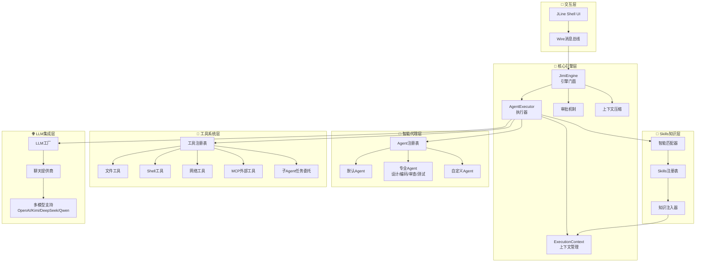
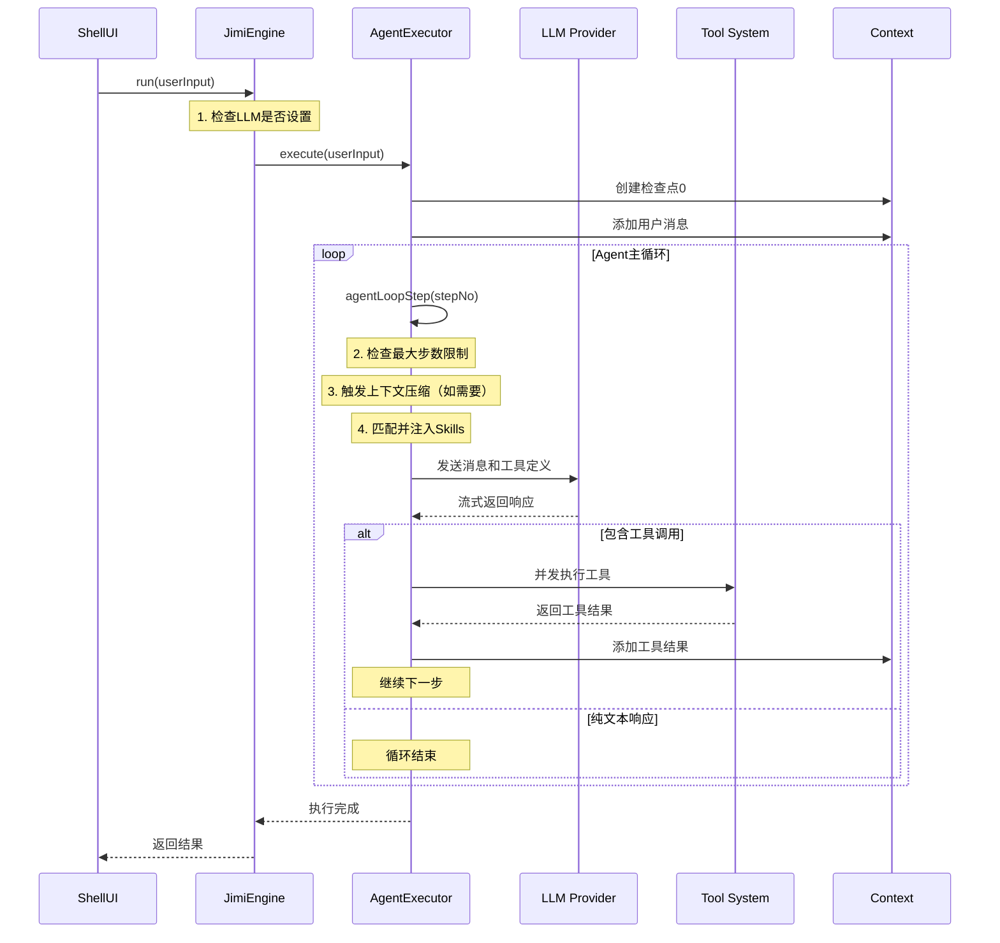
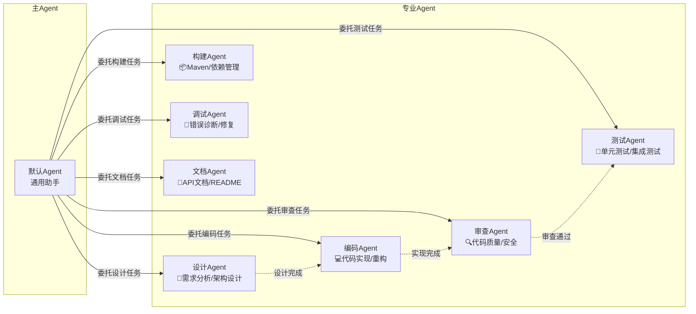
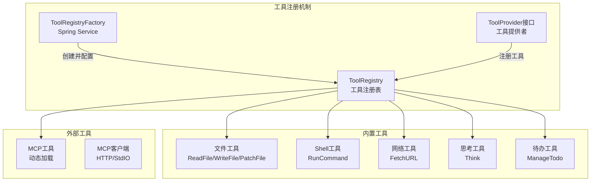
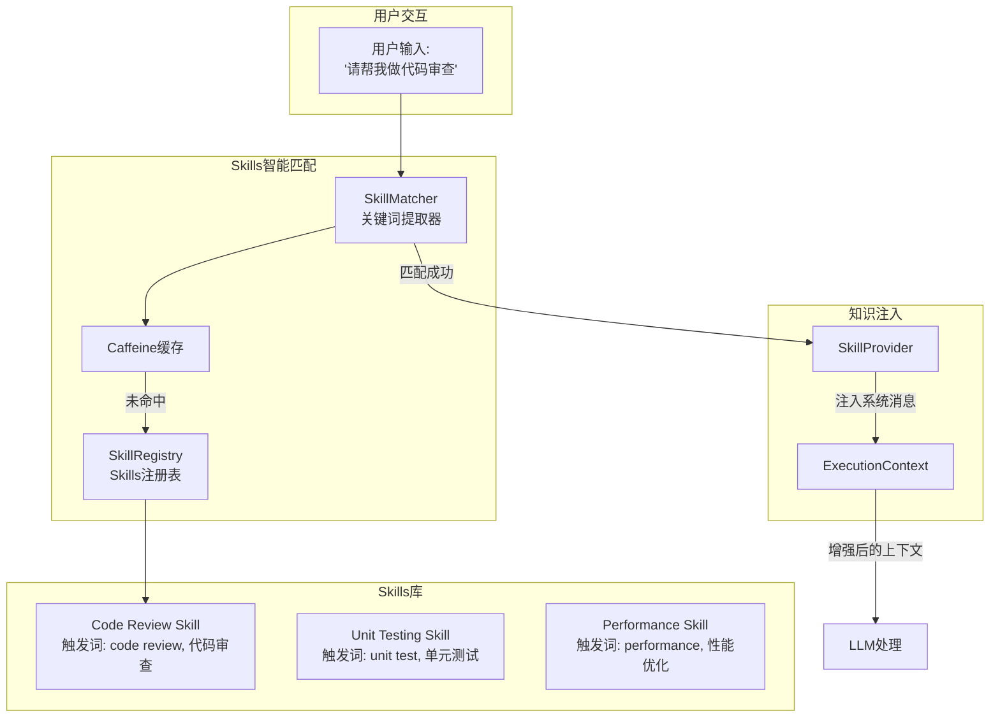
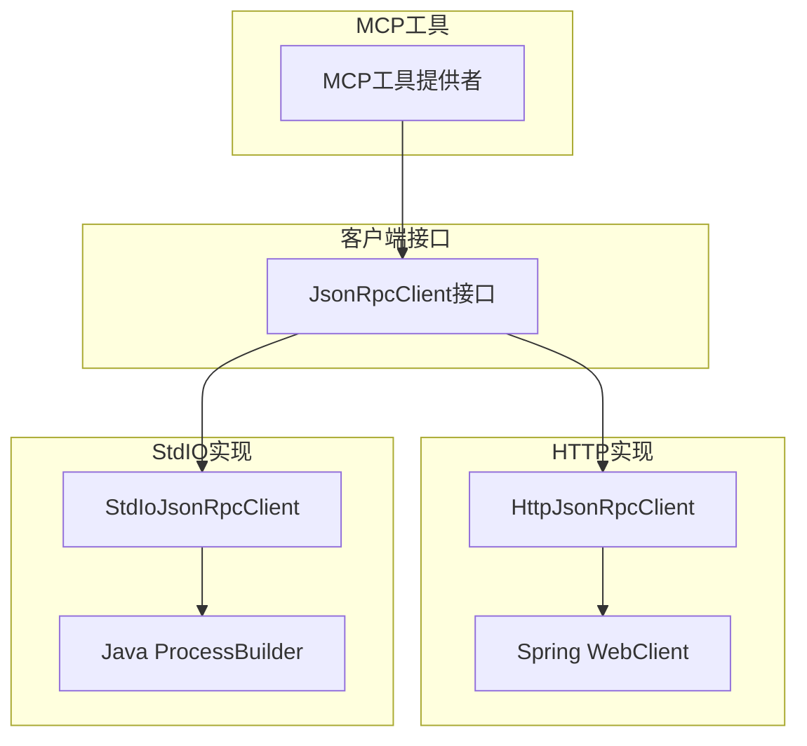
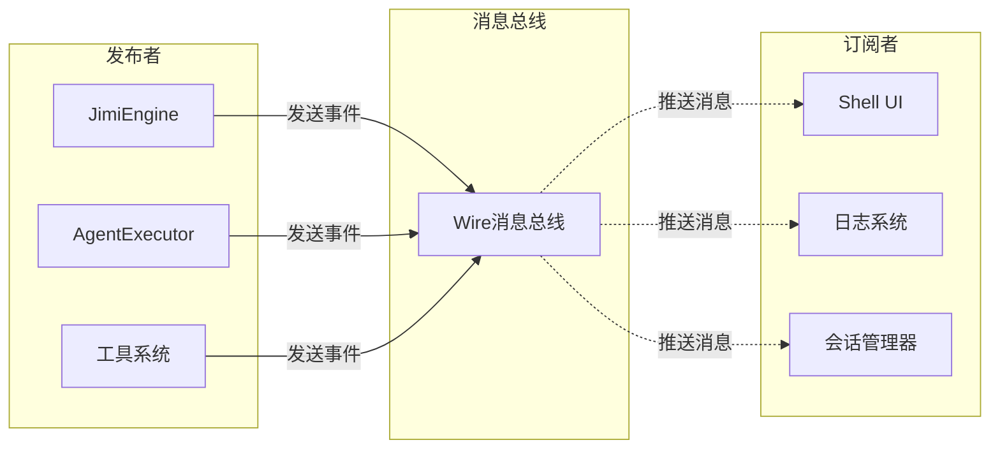

# Jimi：打造Java程序员专属的开源ClaudeCode

> 作者：山泽
> 
> 一个完全用Java实现的AI驱动CLI智能代理系统，为Java开发者带来可深度定制的类ClaudeCode开源。

## 引言：为什么Java程序员需要自己的AI代理？

在AI辅助编程的浪潮中，Cursor、Claude Code等工具为开发者带来了革命性的体验。但对于Java生态的开发者来说，我们面临着一些独特的挑战：

- 🔧 **技术栈割裂**：主流AI工具多用Python实现，与Java项目集成困难
- 📚 **企业级需求**：需要支持Spring Boot、Maven、微服务等企业级框架
- 🔐 **私有化部署**：企业对代码安全有严格要求，需要可控的本地方案
- 🎯 **深度定制**：希望能深入理解并定制AI代理的行为逻辑

**Jimi项目的诞生正是为了解决这些痛点**——用纯Java技术栈，从零构建一个功能完整、可扩展、企业级的AI智能代理系统。

### Jimi的核心价值

- **🎓 教育友好**：清晰的代码架构，完整的中文注释，让每一行代码都能成为学习资源
- **🏢 企业级设计**：基于Spring Boot 3.2.5，支持响应式编程，生产级质量保证
- **🔌 开放生态**：支持MCP协议，可集成各类外部工具和服务
- **🧩 极致模块化**：像搭乐高一样组合功能，每个模块职责明确，易于扩展
- **💡 知识注入**：灵活的Skills系统，让AI可以按需获取领域专业知识

## 第一章：架构之美——分层设计的智慧

### 1.1 从"积木"的角度理解Jimi

想象一下，如果要建造一座智能大厦，我们需要什么？首先是坚实的地基（基础设施），然后是稳定的骨架（核心引擎），再是灵活的功能模块（Agent和工具），最后是友好的交互界面（UI）。Jimi的架构设计正是遵循了这样的思路：



这种分层设计带来了显著的优势：

- **🔒 底层稳定**：消息总线和执行引擎为整个系统提供可靠基础
- **🎯 中层灵活**：Agent和工具系统提供丰富的功能组件
- **🚀 上层开放**：支持多种LLM、自定义Agent、外部工具集成

### 1.2 核心模块一览

Jimi共包含8个核心功能域，每个域都有明确的职责边界：

| 功能域 | 核心模块 | 主要职责 | 设计亮点 |
|--------|---------|---------|---------|
| **核心引擎** | `JimiEngine`<br/>`AgentExecutor` | 任务执行与调度 | 委托模式，单一职责 |
| **Agent系统** | `AgentRegistry`<br/>`AgentSpecLoader` | Agent管理与加载 | YAML配置化，模板渲染 |
| **工具系统** | `ToolRegistry`<br/>`ToolRegistryFactory` | 工具注册与执行 | Spring集成，插件化 |
| **LLM集成** | `LLMFactory`<br/>`ChatProvider` | 多模型支持 | Caffeine缓存，流式响应 |
| **Skills系统** | `SkillMatcher`<br/>`SkillProvider` | 知识智能注入 | 关键词匹配，自动激活 |
| **消息总线** | `Wire`<br/>`WireMessage` | 组件解耦通信 | 响应式流，事件驱动 |
| **会话管理** | `Session`<br/>`Context` | 上下文持久化 | 检查点机制，智能压缩 |
| **UI交互** | `ShellUI`<br/>`OutputFormatter` | 命令行界面 | JLine3，彩色输出 |

## 第二章：核心引擎——Agent执行的"心脏"

### 2.1 设计理念：委托与解耦

在早期版本中，`JimiEngine`承担了过多的职责（执行循环、工具调用、上下文管理等），导致代码复杂度高、难以测试。经过重构，我们采用了**委托模式**：

- **JimiEngine**：作为Engine接口的实现，专注于**组件装配和协调**
- **AgentExecutor**：承担**主循环调度和执行逻辑**，是真正的"引擎心脏"



### 2.2 核心代码解析

让我们深入`AgentExecutor`的核心逻辑，看看它是如何协调各个组件的：

```java
@Slf4j
public class AgentExecutor {
    
    private final Agent agent;
    private final Runtime runtime;
    private final Context context;
    private final Wire wire;
    private final ToolRegistry toolRegistry;
    private final Compaction compaction;
    private final SkillMatcher skillMatcher;
    private final SkillProvider skillProvider;
    
    /**
     * 执行 Agent 任务的入口方法
     */
    public Mono<Void> execute(List<ContentPart> userInput) {
        return Mono.defer(() -> {
            // 1. 创建检查点 0（初始状态）
            return context.checkpoint(false)
                    // 2. 添加用户消息到上下文
                    .flatMap(checkpointId -> context.appendMessage(Message.user(userInput)))
                    // 3. 启动Agent主循环
                    .then(agentLoop())
                    .doOnSuccess(v -> log.info("Agent execution completed"))
                    .doOnError(e -> log.error("Agent execution failed", e));
        });
    }
    
    /**
     * Agent 主循环的单步执行
     */
    private Mono<Void> agentLoopStep(int stepNo) {
        // 检查是否超过最大步数限制
        int maxSteps = runtime.getConfig().getLoopControl().getMaxStepsPerRun();
        if (stepNo > maxSteps) {
            return Mono.error(new MaxStepsReachedException(maxSteps));
        }
        
        // 发送步骤开始消息（通过Wire通知UI）
        wire.send(new StepBegin(stepNo, isSubagent, agentName));
        
        return Mono.defer(() -> {
            // 1. 检查上下文是否超限，必要时触发压缩
            return checkAndCompactContext()
                    // 2. 创建步骤检查点
                    .then(context.checkpoint(true))
                    // 3. 匹配并注入Skills（智能知识注入）
                    .then(matchAndInjectSkills(stepNo))
                    // 4. 执行单步：调用LLM并处理响应
                    .then(step())
                    .flatMap(finished -> {
                        if (finished) {
                            // LLM返回纯文本，没有工具调用，循环结束
                            log.info("Agent loop finished at step {}", stepNo);
                            return Mono.empty();
                        } else {
                            // 有工具调用，继续下一步
                            return agentLoopStep(stepNo + 1);
                        }
                    });
        });
    }
}
```

**设计亮点**：

1. **响应式编程**：使用Reactor的`Mono`，天然支持异步非阻塞
2. **检查点机制**：每个步骤创建检查点，支持回滚和错误恢复
3. **消息总线解耦**：通过`Wire`发送事件，UI层无需直接耦合
4. **智能循环控制**：支持最大步数限制、连续无工具调用检测

### 2.3 流式响应处理的精妙设计

LLM的流式响应（Streaming）是提升用户体验的关键。Jimi采用了**累加器模式**来处理流式数据：

```java
/**
 * 流式累加器：用于组装完整的Assistant消息
 */
private static class StreamAccumulator {
    StringBuilder contentBuilder = new StringBuilder();     // 累积文本内容
    List<ToolCall> toolCalls = new ArrayList<>();          // 累积工具调用
    ChatCompletionResult.Usage usage;                      // Token使用统计
    
    // 用于临时存储正在构建的工具调用
    String currentToolCallId;
    String currentFunctionName;
    StringBuilder currentArguments = new StringBuilder();
}

/**
 * 处理流式数据块
 */
private StreamAccumulator processStreamChunk(StreamAccumulator acc, ChatCompletionChunk chunk) {
    switch (chunk.getType()) {
        case CONTENT:
            // 文本内容：实时累加并通过Wire发送到UI
            String contentDelta = chunk.getContentDelta();
            acc.contentBuilder.append(contentDelta);
            wire.send(new ContentPartMessage(new TextPart(contentDelta)));
            break;
            
        case TOOL_CALL:
            // 工具调用：逐块累积参数JSON
            handleToolCallChunk(acc, chunk);
            break;
            
        case DONE:
            // 流结束：记录Token使用情况
            acc.usage = chunk.getUsage();
            break;
    }
    return acc;
}
```

**技术亮点**：

- **实时反馈**：每个内容片段立即发送到UI，用户感知延迟极低
- **容错机制**：处理LLM可能先发送arguments、后发送id的异常情况
- **临时ID策略**：当收到参数但没有ID时，创建临时ID确保数据不丢失

## 第三章：Agent系统——专业分工的协作之道

### 3.1 多Agent协作架构

Jimi支持多种专业化Agent，每个Agent都有明确的职责边界：



### 3.2 Agent的配置化设计

Jimi采用**YAML配置 + Markdown模板**的方式定义Agent，极大提升了可定制性：

**agent.yaml示例**：

```yaml
name: "Code Agent"
description: "专业的代码实现Agent"
model: null  # 继承默认模型

# 可以委托的子Agent
subagents:
  - review
  - test

# 可用工具列表
tools:
  - read_file
  - write_to_file
  - str_replace_file
  - patch_file
  - bash
  - glob
  - grep
  - think

# 排除的工具（从标准工具集中移除）
exclude_tools:
  - fetch_url
  - set_todo_list

# 系统提示词参数（用于模板渲染）
system_prompt_args:
  CODING_STYLE: "遵循阿里巴巴Java开发手册"
  JAVA_VERSION: "17"
```

**system_prompt.md模板**：

```markdown
# 角色定位
你是一位经验丰富的Java高级工程师，专注于高质量代码实现。

# 工作环境
- 当前时间: ${JIMI_NOW}
- 工作目录: ${JIMI_WORK_DIR}
- Java版本: ${JAVA_VERSION}
- 编码规范: ${CODING_STYLE}

# 核心能力
1. 根据设计文档完成代码实现
2. 编写符合规范的注释和文档
3. 进行代码重构和优化
4. 处理异常情况和边界条件

# 工作流程
1. 仔细阅读需求和设计文档
2. 分析现有代码结构
3. 实现新功能或修复Bug
4. 编写必要的注释
5. 委托Review Agent进行代码审查
```

### 3.3 Agent加载与渲染机制

`AgentRegistry`负责Agent的加载和管理：

```java
@Service
public class AgentRegistry {
    
    @Autowired
    private AgentSpecLoader specLoader;
    
    /**
     * 加载Agent实例，支持模板渲染
     */
    public Mono<Agent> loadAgent(Path agentFile, Runtime runtime) {
        return loadAgentSpec(agentFile).flatMap(spec -> {
            // 渲染系统提示词模板
            String systemPrompt = renderSystemPrompt(
                spec.getSystemPromptPath(), 
                spec.getSystemPromptArgs(), 
                runtime.getBuiltinArgs()
            );
            
            // 构建Agent实例
            Agent agent = Agent.builder()
                .name(spec.getName())
                .systemPrompt(systemPrompt)
                .model(spec.getModel())
                .tools(processedTools)
                .build();
            
            return Mono.just(agent);
        });
    }
    
    /**
     * 渲染系统提示词（使用Apache Commons Text）
     */
    private String renderSystemPrompt(Path promptPath, Map<String, String> args, 
                                     BuiltinSystemPromptArgs builtinArgs) {
        String template = Files.readString(promptPath);
        
        // 准备替换参数（内置参数 + 自定义参数）
        Map<String, String> substitutionMap = new HashMap<>();
        substitutionMap.put("JIMI_NOW", builtinArgs.getJimiNow());
        substitutionMap.put("JIMI_WORK_DIR", builtinArgs.getJimiWorkDir().toString());
        if (args != null) {
            substitutionMap.putAll(args);
        }
        
        // 执行字符串替换
        StringSubstitutor substitutor = new StringSubstitutor(substitutionMap);
        return substitutor.replace(template);
    }
}
```

**设计优势**：

- **配置与代码分离**：修改Agent行为无需修改代码
- **模板化**：支持参数替换，动态注入上下文信息
- **可扩展**：新增Agent只需添加配置文件

## 第四章：工具系统——能力的"瑞士军刀"

### 4.1 工具注册与执行架构

Jimi的工具系统采用**注册表模式**，支持工具的动态注册和执行：



### 4.2 工具的标准接口设计

所有工具都实现统一的`Tool`接口：

```java
public interface Tool<P> {
    
    /**
     * 工具名称（对应LLM function calling的name）
     */
    String getName();
    
    /**
     * 工具描述（告诉LLM这个工具的用途）
     */
    String getDescription();
    
    /**
     * 参数类型（用于JSON Schema生成）
     */
    Class<P> getParamsType();
    
    /**
     * 执行工具
     */
    Mono<ToolResult> execute(P params);
}
```

以`ReadFile`工具为例：

```java
@Component
@Scope("prototype")  // 每次获取时创建新实例
public class ReadFile extends AbstractTool<ReadFile.Params> {
    
    @Data
    public static class Params {
        @JsonProperty(required = true)
        @JsonPropertyDescription("要读取的文件路径（相对或绝对路径）")
        private String path;
        
        @JsonPropertyDescription("起始行号（从1开始）")
        private Integer startLine;
        
        @JsonPropertyDescription("结束行号")
        private Integer endLine;
    }
    
    @Override
    protected Mono<ToolResult> executeInternal(Params params) {
        return Mono.fromCallable(() -> {
            Path filePath = resolveWorkPath(params.getPath());
            
            // 验证文件存在且可读
            if (!Files.exists(filePath)) {
                return ToolResult.error("文件不存在: " + params.getPath());
            }
            
            // 读取文件内容
            List<String> lines = Files.readAllLines(filePath);
            
            // 处理行范围
            if (params.getStartLine() != null || params.getEndLine() != null) {
                int start = params.getStartLine() != null ? params.getStartLine() - 1 : 0;
                int end = params.getEndLine() != null ? params.getEndLine() : lines.size();
                lines = lines.subList(Math.max(0, start), Math.min(lines.size(), end));
            }
            
            return ToolResult.success()
                .withOutput(String.join("\n", lines))
                .withMessage("成功读取文件");
        });
    }
}
```

**设计亮点**：

- **Spring集成**：工具作为Spring Bean，自动依赖注入
- **原型作用域**：每次获取新实例，避免状态污染
- **审批机制**：敏感工具（如文件写入、Shell执行）需要审批
- **响应式设计**：返回`Mono<ToolResult>`，支持异步执行

## 第五章：LLM集成——多模型的统一抽象

### 5.1 LLM抽象层设计

Jimi支持多种LLM提供商（OpenAI、Kimi、DeepSeek、Qwen、Ollama等），通过统一的`ChatProvider`接口进行抽象：

```java
public interface ChatProvider {
    
    /**
     * 流式生成聊天完成
     */
    Flux<ChatCompletionChunk> generateStream(
        String systemPrompt, 
        List<Message> messages, 
        List<Object> toolSchemas
    );
    
    /**
     * 获取模型名称
     */
    String getModelName();
}
```

### 5.2 LLM工厂与缓存机制

`LLMFactory`使用**Caffeine高性能缓存**来管理LLM实例：

```java
@Service
public class LLMFactory {
    
    /**
     * LLM实例缓存（Caffeine）
     */
    private final Cache<String, LLM> llmCache;
    
    public LLMFactory(JimiConfig config, ObjectMapper objectMapper) {
        // 初始化Caffeine缓存
        this.llmCache = Caffeine.newBuilder()
            .maximumSize(10)                           // 最多缓存10个模型
            .expireAfterAccess(30, TimeUnit.MINUTES)   // 30分钟未使用则过期
            .recordStats()                             // 记录缓存统计
            .build();
    }
    
    /**
     * 获取或创建LLM实例
     */
    public LLM getOrCreateLLM(String modelName) {
        return llmCache.get(modelName, key -> createLLM(key));
    }
    
    /**
     * 解析API Key（优先使用环境变量）
     */
    private String resolveApiKey(LLMProviderConfig providerConfig) {
        // 构建环境变量名称：{PROVIDER_TYPE}_API_KEY
        String envVarName = providerConfig.getType().toString().toUpperCase() + "_API_KEY";
        String envApiKey = System.getenv(envVarName);
        
        return envApiKey != null ? envApiKey : providerConfig.getApiKey();
    }
}
```

**设计优势**：

- **缓存复用**：避免重复创建LLM实例，提升性能
- **环境变量覆盖**：支持通过环境变量配置API Key，提升安全性
- **Fail-fast验证**：启动时验证配置，避免运行时错误

## 第六章：Skills系统——领域知识的智能注入

### 6.1 Skills系统的设计哲学

Skills（技能包）解决了一个关键问题：**如何让AI在特定领域任务中表现得更专业？**

传统方法是在系统提示词中硬编码所有知识，但这会导致：
- 🚫 **上下文过长**：大量无关知识占用Token
- 🚫 **维护困难**：修改知识需要重新部署
- 🚫 **缺乏共享**：团队间无法复用知识

**Skills系统的解决方案**：

- ✅ **按需激活**：根据用户输入自动匹配相关知识
- ✅ **模块化管理**：每个Skill独立配置，易于维护
- ✅ **团队共享**：支持全局和项目级Skill
- ✅ **高性能**：Caffeine缓存提升匹配效率



### 6.2 Skill配置格式

每个Skill由一个`skill.yaml`文件定义：

```yaml
name: "Java Code Review Checklist"
description: "Java代码审查的完整检查清单和最佳实践"
scope: global

# 触发词（用于智能匹配）
triggers:
  - code review
  - 代码审查
  - 代码质量
  - quality check

# 技能内容（Markdown格式）
content: |
  ## Java代码审查清单
  
  ### 1. 代码规范
  - [ ] 命名符合规范（驼峰、常量大写等）
  - [ ] 缩进和格式一致
  - [ ] 注释清晰且必要
  
  ### 2. 设计原则
  - [ ] 遵循SOLID原则
  - [ ] 单一职责原则
  - [ ] 方法长度合理（建议<50行）
  
  ### 3. 异常处理
  - [ ] 异常不被吞掉
  - [ ] 使用合适的异常类型
  - [ ] 资源正确关闭
```

### 6.3 智能匹配算法

`SkillMatcher`实现了基于关键词的智能匹配：

```java
@Service
public class SkillMatcher {
    
    private Cache<String, List<SkillSpec>> matchCache;
    
    /**
     * 匹配用户输入，返回相关的Skills
     */
    public List<SkillSpec> matchFromInput(List<ContentPart> userInput) {
        String inputText = extractText(userInput);
        
        // 尝试从缓存获取
        String cacheKey = String.valueOf(inputText.hashCode());
        List<SkillSpec> cachedResult = matchCache.getIfPresent(cacheKey);
        if (cachedResult != null) {
            return cachedResult;
        }
        
        // 执行实际匹配
        List<SkillSpec> matchedSkills = performMatch(inputText);
        
        // 缓存结果
        matchCache.put(cacheKey, matchedSkills);
        return matchedSkills;
    }
    
    /**
     * 执行匹配逻辑
     */
    private List<SkillSpec> performMatch(String inputText) {
        // 1. 提取关键词
        Set<String> keywords = extractKeywords(inputText);
        
        // 2. 从注册表中查找候选Skills
        List<SkillSpec> candidateSkills = skillRegistry.findByTriggers(keywords);
        
        // 3. 计算匹配得分并排序
        return candidateSkills.stream()
            .map(skill -> new ScoredSkill(skill, calculateScore(skill, keywords, inputText)))
            .filter(scored -> scored.score >= scoreThreshold)
            .sorted(Comparator.comparingInt(ScoredSkill::getScore).reversed())
            .limit(maxSkills)
            .map(ScoredSkill::getSkill)
            .collect(Collectors.toList());
    }
    
    /**
     * 计算匹配得分
     * 
     * 计分策略：
     * - 触发词精确匹配：+50分
     * - 触发词部分匹配：+30分
     * - 名称匹配：+40分
     * - 关键词在描述中出现：+10分
     */
    private int calculateScore(SkillSpec skill, Set<String> keywords, String fullText) {
        int score = 0;
        
        // 检查触发词匹配
        for (String trigger : skill.getTriggers()) {
            if (keywords.contains(trigger.toLowerCase()) || 
                fullText.toLowerCase().contains(trigger.toLowerCase())) {
                score += 50;
            }
        }
        
        return Math.min(score, 100);
    }
}
```

### 6.4 知识注入流程

`SkillProvider`负责将匹配的Skills注入到上下文：

```java
@Service
public class SkillProvider {
    
    /**
     * 注入Skills到上下文
     */
    public Mono<Void> injectSkills(Context context, List<SkillSpec> skills) {
        // 过滤已激活的Skills
        List<SkillSpec> newSkills = skills.stream()
            .filter(skill -> !context.getActiveSkills().contains(skill))
            .collect(Collectors.toList());
        
        if (newSkills.isEmpty()) {
            return Mono.empty();
        }
        
        // 格式化Skills为系统消息
        String skillsContent = formatSkills(newSkills);
        Message skillsMessage = Message.system(skillsContent);
        
        // 添加到上下文并记录激活的Skills
        return context.appendMessage(skillsMessage)
            .then(context.addActiveSkills(newSkills));
    }
    
    /**
     * 格式化Skills为Markdown文本
     */
    private String formatSkills(List<SkillSpec> skills) {
        StringBuilder sb = new StringBuilder();
        sb.append("<system type=\"skills\">\n\n");
        sb.append("以下技能包已根据当前任务自动激活，请在执行任务时遵循这些专业指南：\n\n");
        
        for (int i = 0; i < skills.size(); i++) {
            SkillSpec skill = skills.get(i);
            sb.append("### ").append(i + 1).append(". ").append(skill.getName()).append("\n\n");
            sb.append(skill.getContent()).append("\n\n");
            if (i < skills.size() - 1) {
                sb.append("---\n\n");
            }
        }
        
        sb.append("</system>");
        return sb.toString();
    }
}
```

**Skills系统的优势**：

- **智能激活**：无需手动选择，系统自动匹配最相关的知识
- **上下文优化**：只注入必要的知识，节省Token
- **团队协作**：支持共享Skills库，团队经验沉淀
- **持续改进**：可随时更新Skills内容，无需修改代码

## 第七章：MCP协议集成——连接外部世界

### 7.1 MCP协议简介

MCP（Model Context Protocol）是一个标准化的AI工具调用协议，允许AI模型与外部服务进行结构化通信。Jimi通过MCP集成，可以：

- 🗄️ **访问数据库**：执行SQL查询、数据分析
- 📁 **操作文件系统**：跨平台文件管理
- 🔗 **调用Git服务**：查看提交历史、分支管理
- 🌐 **集成GitHub**：创建Issue、管理PR

### 7.2 MCP客户端架构



### 7.3 MCP客户端接口

```java
/**
 * JSON-RPC客户端接口
 */
public interface JsonRpcClient extends AutoCloseable {
    
    /**
     * 初始化连接
     */
    MCPSchema.InitializeResult initialize() throws Exception;
    
    /**
     * 获取工具列表
     */
    MCPSchema.ListToolsResult listTools() throws Exception;
    
    /**
     * 调用工具
     */
    MCPSchema.CallToolResult callTool(String toolName, Map<String, Object> arguments) 
        throws Exception;
}
```

**HTTP实现示例**：

```java
public class HttpJsonRpcClient implements JsonRpcClient {
    
    private final WebClient webClient;
    
    @Override
    public MCPSchema.CallToolResult callTool(String toolName, Map<String, Object> arguments) 
            throws Exception {
        JsonRpcRequest request = JsonRpcRequest.builder()
            .method("tools/call")
            .params(Map.of(
                "name", toolName,
                "arguments", arguments
            ))
            .build();
        
        return sendRequest(request, MCPSchema.CallToolResult.class);
    }
}
```

### 7.4 MCP配置示例

```json
{
  "name": "database-server",
  "description": "PostgreSQL数据库查询服务",
  "type": "http",
  "config": {
    "url": "http://localhost:8080/mcp",
    "headers": {
      "Authorization": "Bearer ${DB_API_KEY}"
    }
  }
}
```

## 第八章：消息总线Wire——组件解耦的利器

### 8.1 Wire的设计理念

Wire消息总线通过**发布-订阅模式**实现组件解耦：



### 8.2 Wire接口与实现

```java
/**
 * Wire消息总线接口
 */
public interface Wire {
    void send(WireMessage message);
    Flux<WireMessage> asFlux();
    void complete();
}

/**
 * Wire实现（基于Reactor的Sinks）
 */
public class WireImpl implements Wire {
    
    private final Sinks.Many<WireMessage> sink;
    
    public WireImpl() {
        // 使用Multicast支持多订阅者
        this.sink = Sinks.many().multicast().onBackpressureBuffer();
    }
    
    @Override
    public void send(WireMessage message) {
        sink.tryEmitNext(message);
    }
    
    @Override
    public Flux<WireMessage> asFlux() {
        return sink.asFlux();
    }
}
```

### 8.3 消息类型体系

```java
// 步骤开始消息
public class StepBegin implements WireMessage {
    private int stepNumber;
    private boolean isSubagent;
    private String agentName;
}

// 内容部分消息（LLM流式输出）
public class ContentPartMessage implements WireMessage {
    private ContentPart contentPart;
}

// 工具调用消息
public class ToolCallMessage implements WireMessage {
    private ToolCall toolCall;
}

// Skills激活消息
public class SkillsActivated implements WireMessage {
    private List<String> skillNames;
    private int count;
}
```

### 8.4 UI层的消息处理

```java
public class ShellUI {
    
    private void subscribeWire() {
        wireSubscription = wire.asFlux()
            .subscribe(this::handleWireMessage);
    }
    
    private void handleWireMessage(WireMessage message) {
        if (message instanceof StepBegin stepBegin) {
            printStatus("🤔 Step " + stepBegin.getStepNumber() + " - Thinking...");
            
        } else if (message instanceof ContentPartMessage contentMsg) {
            // 实时打印LLM输出
            printAssistantText(contentMsg.getContentPart().getText());
            
        } else if (message instanceof ToolCallMessage toolCallMsg) {
            // 显示工具调用
            toolVisualization.onToolCallStart(toolCallMsg.getToolCall());
            
        } else if (message instanceof SkillsActivated skillsMsg) {
            printInfo("💡 激活Skills: " + String.join(", ", skillsMsg.getSkillNames()));
        }
    }
}
```

## 第九章：使用示例与最佳实践

### 9.1 基本使用流程

```bash
# 1. 启动Jimi
./scripts/start.sh

# 2. 查看帮助
/help

# 3. 开始对话
请帮我分析src/main/java目录下的代码结构

# 4. 使用专业Agent
/agent code
请帮我实现一个用户注册功能
```

### 9.2 高级使用技巧

**1. 配置Skills功能**

编辑`application.yml`：

```yaml
jimi:
  skill:
    enabled: true
    auto-match: true
    matching:
      score-threshold: 30
      max-matched-skills: 5
```

**2. 使用YOLO模式（自动批准）**

```bash
./scripts/start.sh --yolo
```

**3. 指定工作目录**

```bash
./scripts/start.sh --work-dir /path/to/your/project
```

**4. 会话恢复**

```bash
# 恢复上次会话
./scripts/start.sh --resume

# 使用指定会话
./scripts/start.sh --session my-project
```

### 9.3 开发自定义Agent

创建`agents/my-agent/agent.yaml`：

```yaml
name: "My Custom Agent"
description: "我的专属Agent"
subagents:
  - code
  - review
tools:
  - read_file
  - write_to_file
  - bash
system_prompt_args:
  MY_CUSTOM_PARAM: "自定义参数值"
```

创建`agents/my-agent/system_prompt.md`：

```markdown
你是一位专业的${MY_CUSTOM_PARAM}助手。
当前工作目录：${JIMI_WORK_DIR}
...
```

启动时使用：

```bash
./scripts/start.sh --agent my-agent
```

### 9.4 开发自定义工具

```java
@Component
@Scope("prototype")
public class MyCustomTool extends AbstractTool<MyCustomTool.Params> {
    
    @Data
    public static class Params {
        @JsonProperty(required = true)
        @JsonPropertyDescription("参数描述")
        private String param1;
    }
    
    @Override
    public String getName() {
        return "my_custom_tool";
    }
    
    @Override
    public String getDescription() {
        return "我的自定义工具";
    }
    
    @Override
    protected Mono<ToolResult> executeInternal(Params params) {
        return Mono.fromCallable(() -> {
            // 工具逻辑实现
            return ToolResult.success()
                .withOutput("执行结果")
                .withMessage("执行成功");
        });
    }
}
```

在`ToolRegistryFactory`中注册：

```java
public ToolRegistry createStandardRegistry(...) {
    // ... existing code
    registry.register(createMyCustomTool());
    return registry;
}
```

## 第十章：技术架构总结与展望

### 10.1 核心设计模式总结

| 设计模式 | 应用位置 | 优势 |
|---------|---------|------|
| **委托模式** | JimiEngine → AgentExecutor | 职责分离，易于测试 |
| **工厂模式** | LLMFactory, ToolRegistryFactory | 对象创建与使用解耦 |
| **策略模式** | ChatProvider多实现 | 支持多种LLM提供商 |
| **注册表模式** | ToolRegistry, AgentRegistry | 动态注册和查找 |
| **观察者模式** | Wire消息总线 | 组件解耦通信 |
| **模板方法** | AbstractTool | 复用公共逻辑 |
| **原型模式** | Spring Prototype Bean | 避免状态污染 |

### 10.2 技术栈亮点

- **Spring Boot 3.2.5**：现代企业级框架，依赖注入，配置管理
- **Project Reactor**：响应式编程，异步非阻塞，流式处理
- **Caffeine**：高性能缓存，LRU淘汰，统计功能
- **JLine 3**：强大的终端交互库，自动补全，语法高亮
- **Jackson**：JSON序列化/反序列化，支持注解
- **Apache Commons Text**：字符串替换，模板渲染

### 10.3 性能优化策略

1. **多层缓存**：
   - LLM实例缓存（Caffeine）
   - Skills匹配结果缓存
   - Agent规范缓存

2. **并发执行**：
   - 多个工具调用并发执行（Flux.merge）
   - 流式响应实时推送

3. **上下文压缩**：
   - 自动检测Token超限
   - 智能压缩历史消息

4. **资源管理**：
   - Spring Bean作用域控制
   - AutoCloseable资源自动释放

### 10.4 未来发展方向

#### 短期计划

- 🔥 **增强Skills系统**：
  - 支持模板变量和动态内容生成
  - 实现基于上下文的动态Skills匹配
  - 支持Skills间的依赖关系

- 🚀 **扩展工具生态**：
  - 集成更多MCP服务（GitHub, Jira, Slack等）
  - 开发代码分析工具（AST解析、依赖分析）
  - 支持数据库Schema分析

- 💡 **优化用户体验**：
  - Web UI界面（可选）
  - IDE插件（IntelliJ IDEA, VS Code）
  - 更丰富的可视化输出

#### 中期计划

- 🧠 **智能化增强**：
  - 引入RAG（检索增强生成）
  - 支持项目知识库自动构建
  - 上下文智能摘要

- 🌐 **分布式支持**：
  - 多Agent并行协作
  - 分布式工具执行
  - 云端LLM服务集成

- 📊 **可观测性**：
  - 性能监控和指标采集
  - 执行过程可视化
  - 成本分析和优化建议

#### 长期愿景

- 🎯 **企业级增强**：
  - 多租户支持
  - 权限和审计系统
  - 企业知识库集成

- 🔐 **安全性强化**：
  - 代码安全扫描
  - 敏感信息检测
  - 合规性检查

- 🌟 **生态建设**：
  - 插件市场
  - Skills共享平台
  - 社区贡献机制

## 结语：开源的力量，Java的未来

Jimi项目不仅仅是一个AI代理工具，更是一次对"用Java做AI"的深度探索。通过这个项目，我们证明了：

- ✅ **Java完全可以胜任AI应用开发**：响应式编程、流式处理、高性能缓存，一应俱全
- ✅ **企业级设计可以与AI完美结合**：Spring Boot的依赖注入、配置管理、测试框架，为AI应用提供坚实基础
- ✅ **模块化架构让AI系统更易维护**：清晰的职责边界、可插拔的组件设计，降低了复杂度
- ✅ **开源社区的力量无穷**：通过分享代码、文档和经验，让更多开发者受益

### 给Java开发者的建议

如果你也对AI感兴趣，不妨从Jimi开始：

1. **Clone代码，深入阅读**：每个模块都有详细的注释
2. **运行测试，理解流程**：单元测试覆盖核心逻辑
3. **尝试扩展，实践学习**：自定义Agent、工具、Skills
4. **参与贡献，共同成长**：提交PR，分享经验

### 项目信息

- **GitHub仓库**：[https://github.com/your-repo/jimi](https://github.com/your-repo/jimi)
- **文档中心**：项目根目录`.qoder/repowiki/`
- **技术讨论**：GitHub Discussions
- **问题反馈**：GitHub Issues

### 致谢

感谢以下开源项目为Jimi提供的灵感和支持：

- [Spring Boot](https://spring.io/projects/spring-boot) - 企业级应用框架
- [Project Reactor](https://projectreactor.io/) - 响应式编程库
- [Caffeine](https://github.com/ben-manes/caffeine) - 高性能缓存
- [JLine](https://github.com/jline/jline3) - 终端交互库
- [Model Context Protocol](https://modelcontextprotocol.io/) - AI工具标准协议

---

**让我们一起，用Java打造属于Java开发者的AI未来！** 🚀
---

*关于作者：山泽，AI技术爱好者，Jimi项目发起人。致力于推动Java在AI领域的发展，让更多Java开发者能够轻松踏入AI的世界。*

*如果您对Jimi项目感兴趣，欢迎访问GitHub仓库，参与开源贡献，共同建设Java AI生态！*
> 如果觉得这篇文章对你有帮助，请给Jimi项目一个⭐Star，让更多Java开发者看到！
