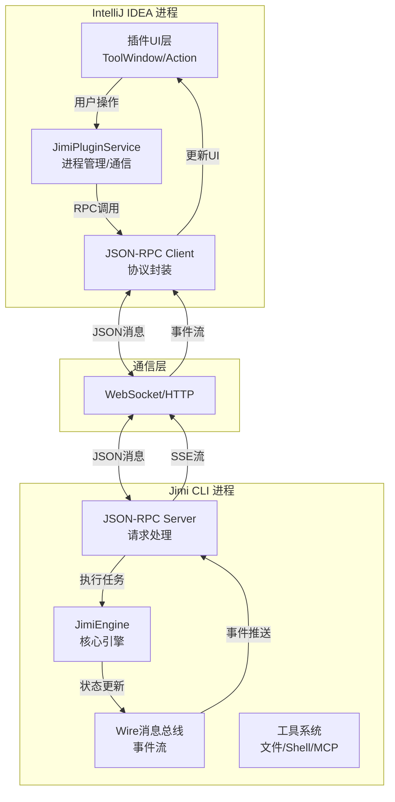
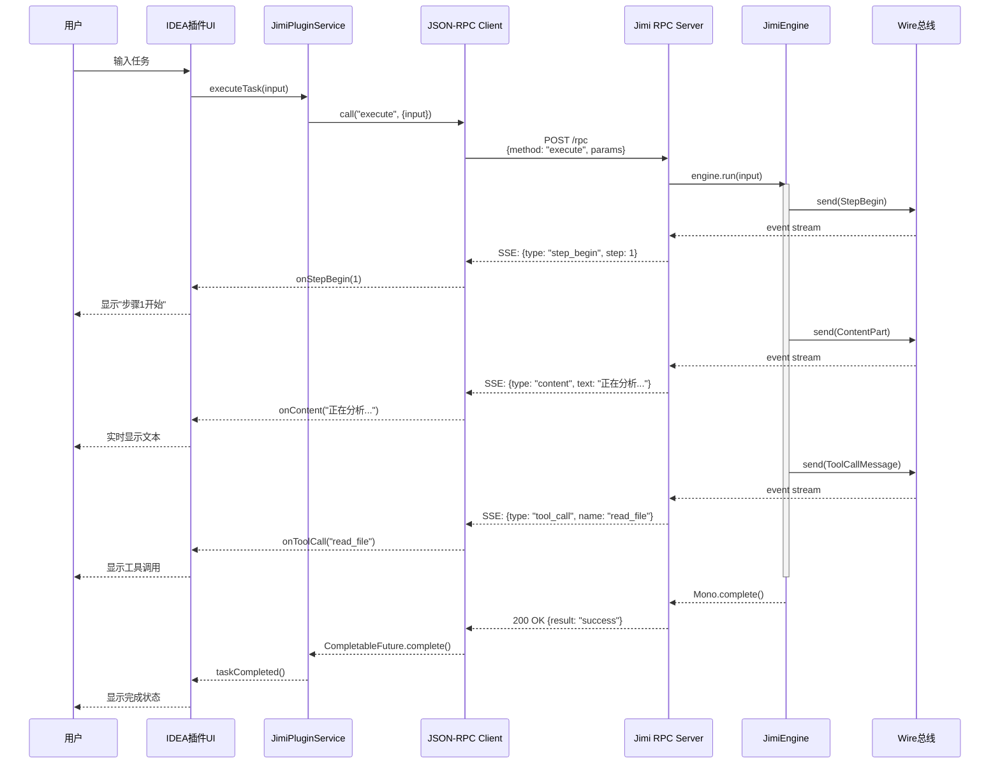

# Jimi IntelliJ IDEA 插件集成技术方案

> **方案类型**: 进程隔离 - 外部进程通信模式  
> **版本**: v1.0  
> **创建日期**: 2024-12-02  
> **复杂度评估**: ⭐️⭐️ (简单)

---

## 📋 目录

1. [方案概述](#方案概述)
2. [架构设计](#架构设计)
3. [通信协议设计](#通信协议设计)
4. [技术实现细节](#技术实现细节)
5. [开发计划](#开发计划)
6. [风险评估](#风险评估)
7. [附录](#附录)

---

## 方案概述

### 1.1 核心理念

**保持Jimi CLI独立运行,IDEA插件通过JSON-RPC协议与Jimi进程通信,实现松耦合集成。**

### 1.2 架构优势

| 优势项 | 说明 |
|--------|------|
| ✅ **最小改动** | Jimi CLI代码改动量 < 10%,无需重构核心逻辑 |
| ✅ **独立演进** | Jimi CLI和IDEA插件可独立版本发布 |
| ✅ **进程隔离** | 插件崩溃不影响IDEA主进程,内存隔离 |
| ✅ **跨平台** | 基于标准JSON-RPC,未来可扩展到VSCode等 |
| ✅ **快速开发** | 预计1-2人月完成MVP版本 |

### 1.3 适用场景

- ✅ 希望快速集成到IDE,验证产品方向
- ✅ Jimi功能频繁迭代,不希望IDE插件跟随改动
- ✅ 需要支持多种IDE(未来扩展VSCode、Eclipse等)
- ⚠️ 对性能要求不是极致(进程间通信有毫秒级延迟)

---

## 架构设计

### 2.1 整体架构图



### 2.2 核心组件职责

#### 2.2.1 IDEA插件端组件

| 组件 | 职责 | 技术栈 |
|------|------|--------|
| **PluginUI** | 用户交互界面,显示对话内容、工具调用等 | IntelliJ Platform SDK |
| **JimiPluginService** | 管理Jimi进程生命周期、连接管理 | Java Process API |
| **RPCClient** | 封装JSON-RPC协议,提供同步/异步API | OkHttp + Jackson |
| **EventStreamHandler** | 处理SSE事件流,转换为UI更新 | RxJava/Kotlin Flow |

#### 2.2.2 Jimi CLI端组件(新增)

| 组件 | 职责 | 实现复杂度 |
|------|------|-----------|
| **RPCServer** | 监听HTTP端口,解析JSON-RPC请求 | ⭐️⭐️⭐️ |
| **CommandHandler** | 将RPC请求映射到JimiEngine操作 | ⭐️⭐️ |
| **EventPublisher** | 将Wire消息转换为SSE事件流 | ⭐️⭐️⭐️ |

### 2.3 数据流时序图



---

## 通信协议设计

### 3.1 JSON-RPC 2.0 基础协议

#### 3.1.1 请求格式

```json
{
  "jsonrpc": "2.0",
  "id": "req-123",
  "method": "execute",
  "params": {
    "input": "帮我分析这个项目的架构",
    "workDir": "/path/to/project",
    "sessionId": "session-abc"
  }
}
```

#### 3.1.2 响应格式

**成功响应:**
```json
{
  "jsonrpc": "2.0",
  "id": "req-123",
  "result": {
    "status": "success",
    "taskId": "task-456"
  }
}
```

**错误响应:**
```json
{
  "jsonrpc": "2.0",
  "id": "req-123",
  "error": {
    "code": -32600,
    "message": "LLM not configured",
    "data": {
      "detail": "请在 ~/.jimi/config.yml 中配置LLM"
    }
  }
}
```

### 3.2 API 方法定义

#### 3.2.1 核心方法

| 方法名 | 参数 | 返回值 | 说明 |
|--------|------|--------|------|
| `initialize` | `{workDir, agentName?, model?}` | `{sessionId, status}` | 初始化会话 |
| `execute` | `{input, sessionId}` | `{taskId, status}` | 执行任务(异步) |
| `getStatus` | `{sessionId}` | `{step, tokenCount, ...}` | 获取引擎状态 |
| `interrupt` | `{sessionId}` | `{status}` | 中断当前任务 |
| `shutdown` | `{sessionId}` | `{status}` | 关闭会话 |

#### 3.2.2 方法详细说明

##### initialize - 初始化会话

**请求:**
```json
{
  "method": "initialize",
  "params": {
    "workDir": "/Users/yefei.yf/MyProject",
    "agentName": "default",
    "model": "qwen-max",
    "yolo": false
  }
}
```

**响应:**
```json
{
  "result": {
    "sessionId": "session-2024-12-02-abc123",
    "status": "initialized",
    "config": {
      "agent": "default",
      "model": "qwen-max",
      "maxSteps": 100
    }
  }
}
```

##### execute - 执行任务

**请求:**
```json
{
  "method": "execute",
  "params": {
    "sessionId": "session-abc123",
    "input": "分析项目架构并生成文档"
  }
}
```

**响应(立即返回):**
```json
{
  "result": {
    "taskId": "task-456",
    "status": "running"
  }
}
```

**实时事件流(SSE):** 见3.3节

##### getStatus - 获取引擎状态

**请求:**
```json
{
  "method": "getStatus",
  "params": {
    "sessionId": "session-abc123"
  }
}
```

**响应:**
```json
{
  "result": {
    "currentStep": 5,
    "maxSteps": 100,
    "tokenCount": 1250,
    "maxContextSize": 32000,
    "availableTokens": 28750,
    "checkpointCount": 3,
    "status": "running"
  }
}
```

### 3.3 SSE事件流协议

#### 3.3.1 事件类型映射


| Wire消息类型 | SSE事件类型 | 数据结构 |
|-------------|------------|---------|
| `StepBegin` | `step_begin` | `{step: number, timestamp: string}` |
| `StepInterrupted` | `step_interrupted` | `{reason: string}` |
| `ContentPartMessage` | `content` | `{text: string, delta: boolean}` |
| `ToolCallMessage` | `tool_call` | `{id, name, arguments}` |
| `ToolResultMessage` | `tool_result` | `{id, result, error?}` |
| `CompactionBegin` | `compaction_begin` | `{reason: string}` |
| `CompactionEnd` | `compaction_end` | `{saved: number}` |
| `StatusUpdate` | `status_update` | `{field, value}` |
| `SkillsActivated` | `skills_activated` | `{skills: string[]}` |

#### 3.3.2 SSE事件示例

```
event: step_begin
data: {"step": 1, "timestamp": "2024-12-02T10:30:00Z"}

event: content
data: {"text": "我来帮你分析", "delta": true}

event: content
data: {"text": "项目架构。", "delta": true}

event: tool_call
data: {"id": "call_123", "name": "read_file", "arguments": {"path": "pom.xml"}}

event: tool_result
data: {"id": "call_123", "result": "<?xml version=\"1.0\"..."}

event: content
data: {"text": "这是一个Maven项目...", "delta": true}

event: done
data: {"status": "success", "totalSteps": 1}
```

### 3.4 传输层选择

#### 方案A: HTTP + SSE (推荐 ⭐️⭐️⭐️⭐️⭐️)

**实现:**
```java
// Jimi端: Spring WebFlux Controller
@RestController
@RequestMapping("/api/v1")
public class JimiRpcController {
    
    @PostMapping("/rpc")
    public Mono<JsonRpcResponse> handleRpc(@RequestBody JsonRpcRequest request) {
        // 处理RPC调用
    }
    
    @GetMapping(value = "/events/{sessionId}", produces = MediaType.TEXT_EVENT_STREAM_VALUE)
    public Flux<ServerSentEvent<WireEventDto>> streamEvents(@PathVariable String sessionId) {
        Wire wire = sessionManager.getSession(sessionId).getWire();
        return wire.asFlux()
            .map(this::convertToSSE);
    }
}
```

**优点:**
- ✅ 实现简单,Jimi已有Spring Boot基础
- ✅ 天然支持HTTP穿透防火墙
- ✅ SSE标准化,易于调试

**缺点:**
- ⚠️ 需要启动HTTP服务器(端口管理)

#### 方案B: WebSocket (备选)

**优点:**
- ✅ 真正的双向通信
- ✅ 可以推送中断命令

**缺点:**
- ⚠️ 实现复杂度稍高
- ⚠️ 调试相对困难

**推荐**: **方案A (HTTP + SSE)** - 适合本场景(插件→Jimi为主,实时推送为辅)

---

## 技术实现细节

### 4.1 Jimi CLI端改造

#### 4.1.1 新增RPC模式启动


```java
@Option(names = {"--server"}, description = "Start in RPC server mode")
private boolean serverMode;

@Option(names = {"--port"}, description = "RPC server port")
private int port = 9527;

@Override
public void run(String... args) {
    if (serverMode) {
        startRpcServer();
    } else {
        startInteractiveShell();
    }
}

private void startRpcServer() {
    log.info("Starting Jimi RPC Server on port {}", port);
    // 启动WebFlux服务器
    JimiRpcServer server = applicationContext.getBean(JimiRpcServer.class);
    server.start(port);
}
```

#### 4.1.2 实现RPC服务器

**新建 `JimiRpcServer.java`:**

```java
@Component
public class JimiRpcServer {
    
    @Autowired
    private JimiFactory jimiFactory;
    
    @Autowired
    private SessionManager sessionManager;
    
    // 会话管理
    private final Map<String, JimiSession> sessions = new ConcurrentHashMap<>();
    
    public void start(int port) {
        HttpHandler handler = RouterFunctions.toHttpHandler(
            RouterFunctions.route()
                .POST("/api/v1/rpc", this::handleRpc)
                .GET("/api/v1/events/{sessionId}", this::handleEventStream)
                .build()
        );
        
        ReactorHttpHandlerAdapter adapter = new ReactorHttpHandlerAdapter(handler);
        DisposableServer server = HttpServer.create()
            .port(port)
            .handle(adapter)
            .bindNow();
        
        log.info("Jimi RPC Server started on http://localhost:{}", port);
        server.onDispose().block(); // 阻塞直到关闭
    }
    
    private Mono<ServerResponse> handleRpc(ServerRequest request) {
        return request.bodyToMono(JsonRpcRequest.class)
            .flatMap(this::processRpcRequest)
            .flatMap(result -> ServerResponse.ok().bodyValue(result))
            .onErrorResume(this::handleError);
    }
    
    private Mono<ServerResponse> handleEventStream(ServerRequest request) {
        String sessionId = request.pathVariable("sessionId");
        JimiSession session = sessions.get(sessionId);
        
        if (session == null) {
            return ServerResponse.notFound().build();
        }
        
        Flux<ServerSentEvent<WireEventDto>> eventFlux = session.getEngine()
            .getWire()
            .asFlux()
            .map(this::wireMessageToSSE);
        
        return ServerResponse.ok()
            .contentType(MediaType.TEXT_EVENT_STREAM)
            .body(eventFlux, ServerSentEvent.class);
    }
    
    private Mono<JsonRpcResponse> processRpcRequest(JsonRpcRequest req) {
        return switch (req.getMethod()) {
            case "initialize" -> handleInitialize(req);
            case "execute" -> handleExecute(req);
            case "getStatus" -> handleGetStatus(req);
            case "interrupt" -> handleInterrupt(req);
            case "shutdown" -> handleShutdown(req);
            default -> Mono.error(new MethodNotFoundException(req.getMethod()));
        };
    }
    
    private Mono<JsonRpcResponse> handleInitialize(JsonRpcRequest req) {
        InitializeParams params = extractParams(req, InitializeParams.class);
        
        return Mono.fromCallable(() -> {
            // 创建会话
            Session session = sessionManager.createSession(
                Paths.get(params.getWorkDir())
            );
            
            // 创建JimiEngine
            return jimiFactory.createSoul(
                session,
                params.getAgentName() != null 
                    ? Paths.get("agents/" + params.getAgentName() + "/agent.yaml")
                    : null,
                params.getModel(),
                params.isYolo(),
                null
            ).block();
        })
        .map(engine -> {
            String sessionId = UUID.randomUUID().toString();
            sessions.put(sessionId, new JimiSession(sessionId, engine));
            
            return JsonRpcResponse.success(req.getId(), Map.of(
                "sessionId", sessionId,
                "status", "initialized"
            ));
        });
    }
    
    private Mono<JsonRpcResponse> handleExecute(JsonRpcRequest req) {
        ExecuteParams params = extractParams(req, ExecuteParams.class);
        JimiSession session = sessions.get(params.getSessionId());
        
        if (session == null) {
            return Mono.error(new SessionNotFoundException(params.getSessionId()));
        }
        
        String taskId = UUID.randomUUID().toString();
        
        // 异步执行任务
        session.getEngine()
            .run(params.getInput())
            .subscribeOn(Schedulers.boundedElastic())
            .doOnError(e -> log.error("Task execution failed", e))
            .subscribe();
        
        return Mono.just(JsonRpcResponse.success(req.getId(), Map.of(
            "taskId", taskId,
            "status", "running"
        )));
    }
    
    private Mono<JsonRpcResponse> handleGetStatus(JsonRpcRequest req) {
        GetStatusParams params = extractParams(req, GetStatusParams.class);
        JimiSession session = sessions.get(params.getSessionId());
        
        if (session == null) {
            return Mono.error(new SessionNotFoundException(params.getSessionId()));
        }
        
        Map<String, Object> status = session.getEngine().getStatus();
        return Mono.just(JsonRpcResponse.success(req.getId(), status));
    }
    
    private ServerSentEvent<WireEventDto> wireMessageToSSE(WireMessage msg) {
        WireEventDto dto = convertWireMessage(msg);
        return ServerSentEvent.<WireEventDto>builder()
            .event(dto.getType())
            .data(dto)
            .build();
    }
    
    private WireEventDto convertWireMessage(WireMessage msg) {
        return switch (msg) {
            case StepBegin sb -> new WireEventDto(
                "step_begin", 
                Map.of("step", sb.getStepNumber())
            );
            case ContentPartMessage cpm -> new WireEventDto(
                "content",
                Map.of("text", cpm.getContent().getText(), "delta", true)
            );
            case ToolCallMessage tcm -> new WireEventDto(
                "tool_call",
                Map.of(
                    "id", tcm.getToolCall().getId(),
                    "name", tcm.getToolCall().getFunction().getName(),
                    "arguments", tcm.getToolCall().getFunction().getArguments()
                )
            );
            // ... 其他消息类型转换
            default -> new WireEventDto("unknown", Map.of());
        };
    }
}

// DTO类
@Data
class JimiSession {
    private final String sessionId;
    private final JimiEngine engine;
}

@Data
class WireEventDto {
    private final String type;
    private final Map<String, Object> data;
}
```

#### 4.1.3 依赖配置

**修改 `pom.xml`:**

```xml
<!-- 已有依赖无需改动 -->
<dependency>
    <groupId>org.springframework.boot</groupId>
    <artifactId>spring-boot-starter-webflux</artifactId>
</dependency>

<!-- 新增(如果需要更好的JSON处理) -->
<dependency>
    <groupId>com.fasterxml.jackson.core</groupId>
    <artifactId>jackson-databind</artifactId>
</dependency>
```

### 4.2 IntelliJ IDEA插件端实现

#### 4.2.1 插件结构

```
jimi-intellij-plugin/
├── src/main/
│   ├── kotlin/                    # 推荐使用Kotlin开发IDEA插件
│   │   ├── com/leavesfly/jimi/
│   │   │   ├── JimiPluginService.kt      # 核心服务
│   │   │   ├── rpc/
│   │   │   │   ├── JimiRpcClient.kt      # RPC客户端
│   │   │   │   ├── EventStreamListener.kt # SSE监听器
│   │   │   │   └── models/               # 协议数据模型
│   │   │   ├── ui/
│   │   │   │   ├── JimiToolWindow.kt     # ToolWindow实现
│   │   │   │   ├── ChatPanel.kt          # 对话面板
│   │   │   │   └── StatusBar.kt          # 状态栏
│   │   │   ├── actions/
│   │   │   │   ├── AskJimiAction.kt      # 右键菜单
│   │   │   │   └── InterruptAction.kt    # 中断操作
│   │   │   └── process/
│   │   │       └── JimiProcessManager.kt # 进程管理
│   └── resources/
│       ├── META-INF/
│       │   └── plugin.xml                # 插件配置
│       └── icons/                        # 图标资源
└── build.gradle.kts                      # Gradle构建脚本
```

#### 4.2.2 核心服务实现

**JimiPluginService.kt:**

```kotlin
@Service
class JimiPluginService(private val project: Project) : Disposable {
    
    private val processManager = JimiProcessManager()
    private var rpcClient: JimiRpcClient? = null
    private var currentSessionId: String? = null
    
    companion object {
        fun getInstance(project: Project): JimiPluginService =
            project.service()
    }
    
    /**
     * 启动Jimi进程并建立连接
     */
    suspend fun start(): Boolean {
        return withContext(Dispatchers.IO) {
            try {
                // 1. 启动Jimi进程
                val port = findAvailablePort()
                val jimiJar = findJimiJar()
                processManager.start(jimiJar, port)
                
                // 2. 等待服务器就绪
                waitForServerReady("http://localhost:$port", timeout = 10.seconds)
                
                // 3. 创建RPC客户端
                rpcClient = JimiRpcClient("http://localhost:$port")
                
                // 4. 初始化会话
                val response = rpcClient!!.initialize(
                    workDir = project.basePath!!,
                    agentName = "default",
                    model = null
                )
                currentSessionId = response.sessionId
                
                // 5. 订阅事件流
                subscribeEventStream()
                
                true
            } catch (e: Exception) {
                logger.error("Failed to start Jimi", e)
                false
            }
        }
    }
    
    /**
     * 执行任务
     */
    suspend fun executeTask(input: String): String {
        val sessionId = currentSessionId
            ?: throw IllegalStateException("Jimi not initialized")
        
        return rpcClient!!.execute(sessionId, input).taskId
    }
    
    /**
     * 订阅事件流
     */
    private fun subscribeEventStream() {
        val sessionId = currentSessionId ?: return
        
        rpcClient!!.subscribeEvents(sessionId) { event ->
            // 在EDT线程更新UI
            ApplicationManager.getApplication().invokeLater {
                handleEvent(event)
            }
        }
    }
    
    private fun handleEvent(event: WireEvent) {
        val toolWindow = ToolWindowManager.getInstance(project)
            .getToolWindow("Jimi") ?: return
        
        val chatPanel = toolWindow.contentManager.getContent(0)
            ?.component as? ChatPanel ?: return
        
        when (event.type) {
            "step_begin" -> {
                val step = event.data["step"] as Int
                chatPanel.showStepBegin(step)
            }
            "content" -> {
                val text = event.data["text"] as String
                chatPanel.appendContent(text)
            }
            "tool_call" -> {
                val name = event.data["name"] as String
                val args = event.data["arguments"] as String
                chatPanel.showToolCall(name, args)
            }
            "tool_result" -> {
                val result = event.data["result"] as String
                chatPanel.showToolResult(result)
            }
            "done" -> {
                chatPanel.showCompleted()
            }
        }
    }
    
    override fun dispose() {
        rpcClient?.close()
        processManager.stop()
    }
}
```

**JimiRpcClient.kt:**

```kotlin
class JimiRpcClient(private val baseUrl: String) : Closeable {
    
    private val httpClient = OkHttpClient.Builder()
        .connectTimeout(30, TimeUnit.SECONDS)
        .readTimeout(300, TimeUnit.SECONDS)
        .build()
    
    private val objectMapper = jacksonObjectMapper()
    private var eventSource: EventSource? = null
    
    /**
     * 初始化会话
     */
    suspend fun initialize(
        workDir: String,
        agentName: String?,
        model: String?
    ): InitializeResponse {
        val request = JsonRpcRequest(
            method = "initialize",
            params = mapOf(
                "workDir" to workDir,
                "agentName" to agentName,
                "model" to model
            )
        )
        
        return call(request, InitializeResponse::class.java)
    }
    
    /**
     * 执行任务
     */
    suspend fun execute(sessionId: String, input: String): ExecuteResponse {
        val request = JsonRpcRequest(
            method = "execute",
            params = mapOf(
                "sessionId" to sessionId,
                "input" to input
            )
        )
        
        return call(request, ExecuteResponse::class.java)
    }
    
    /**
     * 订阅事件流
     */
    fun subscribeEvents(sessionId: String, onEvent: (WireEvent) -> Unit) {
        val url = "$baseUrl/api/v1/events/$sessionId"
        
        val request = Request.Builder()
            .url(url)
            .header("Accept", "text/event-stream")
            .build()
        
        eventSource = EventSources.createFactory(httpClient)
            .newEventSource(request, object : EventSourceListener() {
                override fun onEvent(
                    eventSource: EventSource,
                    id: String?,
                    type: String?,
                    data: String
                ) {
                    val event = objectMapper.readValue(data, WireEvent::class.java)
                    onEvent(event)
                }
                
                override fun onFailure(
                    eventSource: EventSource,
                    t: Throwable?,
                    response: Response?
                ) {
                    logger.error("SSE connection failed", t)
                }
            })
    }
    
    private suspend fun <T> call(
        request: JsonRpcRequest,
        responseType: Class<T>
    ): T = withContext(Dispatchers.IO) {
        val body = objectMapper.writeValueAsString(request)
            .toRequestBody("application/json".toMediaType())
        
        val httpRequest = Request.Builder()
            .url("$baseUrl/api/v1/rpc")
            .post(body)
            .build()
        
        val response = httpClient.newCall(httpRequest).execute()
        val jsonResponse = objectMapper.readValue(
            response.body!!.string(),
            JsonRpcResponse::class.java
        )
        
        if (jsonResponse.error != null) {
            throw RpcException(jsonResponse.error)
        }
        
        objectMapper.convertValue(jsonResponse.result!!, responseType)
    }
    
    override fun close() {
        eventSource?.cancel()
        httpClient.dispatcher.executorService.shutdown()
    }
}
```

#### 4.2.3 UI实现

**JimiToolWindow.kt:**

```kotlin
class JimiToolWindow(private val project: Project) {
    
    fun createContent(): JComponent {
        val panel = JPanel(BorderLayout())
        
        // 聊天面板
        val chatPanel = ChatPanel()
        panel.add(JBScrollPane(chatPanel), BorderLayout.CENTER)
        
        // 输入框
        val inputPanel = createInputPanel { input ->
            sendMessage(input)
        }
        panel.add(inputPanel, BorderLayout.SOUTH)
        
        return panel
    }
    
    private fun sendMessage(input: String) {
        val service = JimiPluginService.getInstance(project)
        
        GlobalScope.launch(Dispatchers.Main) {
            try {
                service.executeTask(input)
            } catch (e: Exception) {
                Notifications.Bus.notify(
                    Notification(
                        "Jimi",
                        "执行失败",
                        e.message ?: "Unknown error",
                        NotificationType.ERROR
                    )
                )
            }
        }
    }
}
```

#### 4.2.4 进程管理

**JimiProcessManager.kt:**

```kotlin
class JimiProcessManager {
    private var process: Process? = null
    
    fun start(jimiJar: Path, port: Int) {
        val command = listOf(
            "java",
            "-jar",
            jimiJar.toString(),
            "--server",
            "--port", port.toString()
        )
        
        process = ProcessBuilder(command)
            .redirectErrorStream(true)
            .redirectOutput(ProcessBuilder.Redirect.PIPE)
            .start()
        
        // 异步读取日志
        Thread {
            process!!.inputStream.bufferedReader().useLines { lines ->
                lines.forEach { logger.info("[Jimi] $it") }
            }
        }.start()
    }
    
    fun stop() {
        process?.destroy()
        process?.waitFor(5, TimeUnit.SECONDS)
        process?.destroyForcibly()
    }
    
    fun isRunning(): Boolean = process?.isAlive == true
}
```

#### 4.2.5 插件配置

**plugin.xml:**

```xml
<idea-plugin>
    <id>com.leavesfly.jimi-intellij-plugin</id>
    <name>Jimi AI Assistant</name>
    <version>1.0.0</version>
    <vendor email="support@leavesfly.io" url="https://github.com/leavesfly/jimi">
        Leavesfly
    </vendor>
    
    <description><![CDATA[
        AI-powered coding assistant integrated with Jimi.
    ]]></description>
    
    <depends>com.intellij.modules.platform</depends>
    
    <extensions defaultExtensionNs="com.intellij">
        <!-- ToolWindow -->
        <toolWindow 
            id="Jimi" 
            anchor="right" 
            factoryClass="com.leavesfly.jimi.ui.JimiToolWindowFactory"
            icon="/icons/jimi.svg"/>
        
        <!-- Service -->
        <projectService 
            serviceImplementation="com.leavesfly.jimi.JimiPluginService"/>
    </extensions>
    
    <actions>
        <action 
            id="Jimi.AskJimi" 
            class="com.leavesfly.jimi.actions.AskJimiAction"
            text="Ask Jimi"
            description="Ask Jimi AI to help">
            <add-to-group group-id="EditorPopupMenu" anchor="last"/>
        </action>
    </actions>
</idea-plugin>
```

---

## 开发计划

### 5.1 里程碑规划

#### Phase 1: 基础框架 (1周)

**Jimi CLI端:**
- [ ] 实现`--server`模式启动参数
- [ ] 实现`JimiRpcServer`基础框架
- [ ] 实现`initialize`和`execute`方法
- [ ] 实现Wire到SSE的转换

**IDEA插件端:**
- [ ] 搭建Gradle插件项目
- [ ] 实现`JimiProcessManager`
- [ ] 实现`JimiRpcClient`基础框架
- [ ] 实现简单的ToolWindow UI

**测试:**
- [ ] 手动测试进程启动和连接
- [ ] 验证JSON-RPC基础通信

#### Phase 2: 核心功能 (1-2周)

**Jimi CLI端:**
- [ ] 完善所有RPC方法(`getStatus`, `interrupt`, `shutdown`)
- [ ] 优化事件流性能
- [ ] 添加错误处理和日志

**IDEA插件端:**
- [ ] 实现完整的ChatPanel UI
- [ ] 实现事件流监听和UI更新
- [ ] 添加工具调用可视化
- [ ] 实现状态栏显示

**测试:**
- [ ] 端到端功能测试
- [ ] 异常场景测试(进程崩溃、网络中断等)

#### Phase 3: 优化与发布 (1周)

- [ ] 性能优化(事件流背压处理)
- [ ] 安全性加固(认证、限流)
- [ ] 编写用户文档
- [ ] 打包发布到JetBrains Marketplace

### 5.2 人力分配

| 角色 | 职责 | 工作量 |
|------|------|--------|
| **后端开发** | Jimi RPC Server实现 | 1人周 |
| **前端开发** | IDEA插件UI开发 | 1.5人周 |
| **全栈开发** | 协议设计、联调测试 | 0.5人周 |

**总计**: 约2-3人周 (1人完成需3-4周)

---

## 风险评估

### 6.1 技术风险

| 风险项 | 概率 | 影响 | 缓解措施 |
|--------|------|------|----------|
| **端口冲突** | 中 | 中 | 动态端口分配,范围9527-9537 |
| **进程僵死** | 低 | 高 | 添加健康检查,超时自动重启 |
| **事件流中断** | 中 | 中 | 实现自动重连机制 |
| **序列化错误** | 低 | 低 | 严格Schema校验,版本兼容 |

### 6.2 性能风险

| 指标 | 目标 | 当前预估 | 风险 |
|------|------|----------|------|
| 启动时间 | < 3s | 2-5s | 低 |
| RPC延迟 | < 50ms | 10-30ms | 低 |
| 事件流延迟 | < 100ms | 50-200ms | 中 |
| 内存占用 | < 500MB | 300-600MB | 低 |

**优化方向:**
1. 使用WebSocket替代HTTP+SSE降低延迟
2. 实现事件批量发送减少网络开销
3. 添加本地缓存减少RPC调用

### 6.3 兼容性风险

| 兼容项 | 风险 | 说明 |
|--------|------|------|
| IDEA版本 | 低 | 支持2023.1+ |
| JDK版本 | 低 | 插件和Jimi统一使用JDK 17 |
| 操作系统 | 中 | Windows路径处理需特殊处理 |
| Jimi版本 | 高 | 需定义协议版本号,做好兼容 |

---

## 附录

### A. 协议版本管理

#### A.1 版本号规范

采用语义化版本: `MAJOR.MINOR.PATCH`

**当前版本: v1.0.0**

#### A.2 握手协议

```json
// 客户端在initialize时发送
{
  "method": "initialize",
  "params": {
    "protocolVersion": "1.0.0",
    "clientInfo": {
      "name": "jimi-intellij-plugin",
      "version": "1.0.0"
    },
    "workDir": "/path/to/project"
  }
}

// 服务端响应
{
  "result": {
    "protocolVersion": "1.0.0",
    "serverInfo": {
      "name": "jimi",
      "version": "0.1.0"
    },
    "sessionId": "session-abc"
  }
}
```

### B. 错误码定义

| 错误码 | 说明 | HTTP状态码 |
|--------|------|-----------|
| -32700 | Parse error (JSON格式错误) | 500 |
| -32600 | Invalid request (请求无效) | 400 |
| -32601 | Method not found (方法不存在) | 404 |
| -32602 | Invalid params (参数错误) | 400 |
| -32603 | Internal error (内部错误) | 500 |
| -32000 | Session not found | 404 |
| -32001 | LLM not configured | 500 |
| -32002 | Task execution failed | 500 |

### C. 性能基准测试

```bash
# 启动Jimi RPC Server
java -jar jimi-0.1.0.jar --server --port 9527

# 使用wrk测试RPC性能
wrk -t4 -c100 -d30s \
  -s test/rpc_benchmark.lua \
  http://localhost:9527/api/v1/rpc

# 预期结果:
# Requests/sec: 500-1000
# Latency P99: < 100ms
```

### D. 开发环境搭建

#### D.1 Jimi端

```bash
cd /Users/yefei.yf/CLI/Jimi
mvn clean package -DskipTests
java -jar target/jimi-0.1.0.jar --server --port 9527
```

#### D.2 IDEA插件端

```bash
# 克隆插件项目
git clone https://github.com/leavesfly/jimi-intellij-plugin
cd jimi-intellij-plugin

# 使用Gradle构建
./gradlew buildPlugin

# 启动插件调试(会打开新的IDEA实例)
./gradlew runIde
```

### E. 调试技巧

#### E.1 抓包调试

```bash
# 使用Charles或Wireshark抓取HTTP流量
# 过滤: tcp.port == 9527

# 或使用curl手动测试
curl -X POST http://localhost:9527/api/v1/rpc \
  -H "Content-Type: application/json" \
  -d '{
    "jsonrpc": "2.0",
    "id": "1",
    "method": "initialize",
    "params": {
      "workDir": "/tmp/test"
    }
  }'

# 测试SSE事件流
curl -N http://localhost:9527/api/v1/events/session-abc
```

#### E.2 日志配置

**Jimi端 (logback-spring.xml):**
```xml
<logger name="io.leavesfly.jimi.rpc" level="DEBUG"/>
```

**IDEA插件端:**
```kotlin
private val logger = Logger.getInstance(JimiPluginService::class.java)
logger.debug("RPC request: $request")
```

---

## 总结

本方案通过**进程隔离+JSON-RPC通信**的方式实现Jimi与IntelliJ IDEA的集成:

✅ **优势:**
- 最小改动,Jimi CLI核心逻辑无需重构
- 开发周期短,2-3周即可完成MVP
- 进程隔离,稳定性好
- 易于扩展到其他IDE

⚠️ **注意事项:**
- 需要管理额外的Jimi进程
- 性能略低于深度集成方案
- 需要定义清晰的协议版本管理

📅 **建议路线:**
1. 先快速实现MVP验证可行性
2. 收集用户反馈优化体验
3. 如有必要再考虑深度集成(方案1)

---

**文档版本**: v1.0  
**最后更新**: 2024-12-02  
**维护者**: Jimi开发团队
